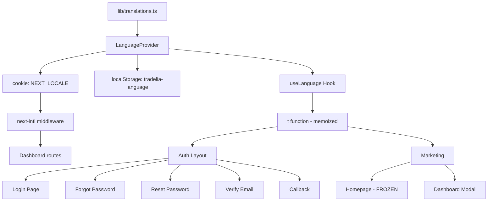

# Design Document - Auth Flow & i18n System

## Overview

Sistema di internazionalizzazione per le pagine di autenticazione e il modale di onboarding Tradelia 2026. Utilizza il sistema `lib/translations.ts` esistente con `useLanguage()` hook per garantire consistenza con la homepage.

### Design Philosophy

- **Consistenza**: Stesso sistema i18n della homepage (`lib/translations.ts`)
- **Bridge Mode**: Sync localStorage + cookie per coerenza marketing/dashboard
- **Layout-level Provider**: Un solo LanguageProvider in `app/auth/layout.tsx`
- **Homepage Freeze**: La homepage non viene modificata
- **Anti-enumeration**: Errori sempre generici, mai confermare esistenza email
- **Tradelia 2026**: Seguire i principi di chiarezza, verificabilità, neutralità

### Target

- Supporto completo IT/EN per tutte le pagine auth
- Zero testo hardcoded in italiano
- Accessibilità WCAG AAA+ con attributi tradotti
- Bundle auth keys < 5KB

## Architecture

### i18n Architecture (Bridge Mode)



### File Structure

```
lib/
├── translations.ts          # Existing - ADD auth keys only
├── locale-preference.ts     # NEW - Bridge Mode sync utility
│
app/
├── layout.tsx               # UPDATE - read locale from cookie for html lang
├── auth/
│   ├── layout.tsx           # NEW - LanguageProvider wrapper (once)
│   ├── login/page.tsx       # UPDATE - use t(), no provider wrap
│   ├── forgot-password/page.tsx
│   ├── reset-password/
│   │   ├── page.tsx
│   │   └── ResetPasswordForm.tsx
│   ├── verify-email/page.tsx
│   └── callback/page.tsx
│
components/
├── LanguageSelector.tsx     # UPDATE - add cookie sync (Bridge Mode)
├── DashboardModal.tsx       # UPDATE - use t() for all text
├── RegistrationForm.tsx     # UPDATE - use t() for all text
├── auth/                    # NEW - reusable auth components
│   ├── AuthStatus.tsx       # Success/error/loading states
│   └── AuthFormField.tsx    # Input with a11y attributes
```

## Components and Interfaces

### 0. Bridge Mode - Locale Preference Sync

```typescript
// lib/locale-preference.ts - NEW
export type Locale = 'it' | 'en';

/**
 * Persists locale preference to both localStorage and cookie
 * for Bridge Mode sync between marketing/auth and dashboard
 */
export function persistLocale(locale: Locale): void {
  // localStorage for marketing/auth (LanguageProvider)
  try {
    if (typeof window !== 'undefined') {
      localStorage.setItem('tradelia-language', locale);
    }
  } catch (e) {
    console.warn('localStorage not available:', e);
  }
  
  // Cookie for dashboard (next-intl)
  if (typeof document !== 'undefined') {
    document.cookie = `NEXT_LOCALE=${locale}; path=/; max-age=31536000; samesite=lax`;
  }
}

/**
 * Reads locale from cookie (SSR-safe) or localStorage (client)
 */
export function getLocale(): Locale {
  // Try cookie first (works in SSR)
  if (typeof document !== 'undefined') {
    const match = document.cookie.match(/NEXT_LOCALE=(\w+)/);
    if (match && (match[1] === 'it' || match[1] === 'en')) {
      return match[1] as Locale;
    }
  }
  
  // Fallback to localStorage
  try {
    if (typeof window !== 'undefined') {
      const saved = localStorage.getItem('tradelia-language');
      if (saved === 'it' || saved === 'en') return saved;
    }
  } catch (e) {
    // Ignore
  }
  
  // Browser detection fallback
  if (typeof navigator !== 'undefined') {
    return navigator.language.startsWith('en') ? 'en' : 'it';
  }
  
  return 'it';
}
```

### 1. Auth Layout (Single Provider)

```typescript
// app/auth/layout.tsx - NEW
'use client';

import { LanguageProvider } from '@/components/LanguageSelector';

export default function AuthLayout({
  children,
}: {
  children: React.ReactNode;
}) {
  return (
    <LanguageProvider>
      {children}
    </LanguageProvider>
  );
}
```

### 2. Translation Keys Structure (Anti-Enumeration)

```typescript
// lib/translations.ts - ADD to existing structure
export const translations = {
  it: {
    // ... existing keys (hero, research, modal, etc.) - DO NOT MODIFY
    
    // NEW: Auth namespace
    auth: {
      common: {
        backToHome: '← Torna alla homepage',
        loading: 'Caricamento...',
        error: 'Errore',
        success: 'Successo',
        or: 'oppure',
        continueWithGoogle: 'Continua con Google',
        rateLimited: 'Troppi tentativi. Riprova più tardi.',
        errorGeneric: 'Si è verificato un errore. Riprova.',
        // Anti-enumeration: generic messages
        emailSentIfExists: 'Se l\'indirizzo è valido, riceverai un\'email.',
        // Aria labels
        aria: {
          closeModal: 'Chiudi',
          submit: 'Invia',
          emailField: 'Campo email',
          passwordField: 'Campo password',
          backToHome: 'Torna alla homepage'
        }
      },
      login: {
        title: 'Accedi al tuo account',
        subtitle: 'Accedi per sincronizzare le tue preferenze',
        email: 'Email',
        emailPlaceholder: 'mario@esempio.it',
        password: 'Password',
        passwordPlaceholder: 'La tua password',
        submit: 'Accedi',
        submitting: 'Accesso in corso...',
        forgotPassword: 'Password dimenticata?',
        noAccount: 'Non hai un account? Completa il questionario sulla homepage per registrarti.',
        errors: {
          required: 'Inserisci email e password',
          // Anti-enumeration: generic error
          invalid: 'Impossibile completare l\'accesso. Riprova.'
        }
      },
      forgotPassword: {
        title: 'Reset password',
        subtitle: 'Inserisci il tuo indirizzo email per ricevere il link di reset.',
        email: 'Indirizzo email',
        emailPlaceholder: 'mario@esempio.it',
        submit: 'Invia link di reset',
        submitting: 'Invio in corso...',
        successTitle: 'Richiesta inviata',
        // Anti-enumeration: generic success
        successSubtitle: 'Se l\'indirizzo è associato a un account, riceverai un\'email con le istruzioni.',
        retry: 'Non hai ricevuto l\'email? Riprova',
        note: 'Controlla anche la cartella spam.',
        errors: {
          required: 'Inserisci il tuo indirizzo email',
          invalid: 'Inserisci un indirizzo email valido',
          sendError: 'Impossibile inviare l\'email. Riprova.'
        }
      },
      resetPassword: {
        title: 'Nuova password',
        subtitle: 'Inserisci la nuova password per completare il reset.',
        newPassword: 'Nuova password',
        newPasswordPlaceholder: 'Minimo 8 caratteri',
        confirmPassword: 'Conferma password',
        confirmPasswordPlaceholder: 'Ripeti la password',
        submit: 'Aggiorna password',
        submitting: 'Aggiornamento...',
        successTitle: 'Password aggiornata',
        successSubtitle: 'La password è stata modificata. Reindirizzamento...',
        redirecting: 'Reindirizzamento in corso...',
        errors: {
          invalidLink: 'Link non valido o scaduto. Richiedi un nuovo link.',
          mismatch: 'Le password non coincidono',
          minLength: 'La password deve essere di almeno 8 caratteri',
          updateError: 'Impossibile aggiornare la password. Riprova.'
        }
      },
      verifyEmail: {
        title: 'Verifica email',
        verifying: 'Verifica email in corso...',
        successTitle: 'Email verificata',
        successSubtitle: 'La tua email è stata verificata. Reindirizzamento alla dashboard...',
        redirecting: 'Reindirizzamento...',
        errorTitle: 'Verifica email',
        errorSubtitle: 'Si è verificato un problema durante la verifica.',
        resend: 'Invia nuova email di verifica',
        resending: 'Invio in corso...',
        resendSuccess: 'Email inviata!',
        errors: {
          invalidLink: 'Link non valido o scaduto.',
          // Anti-enumeration: removed emailNotFound
          verifyError: 'Impossibile verificare l\'email. Riprova.',
          resendError: 'Impossibile inviare l\'email. Riprova.'
        }
      },
      callback: {
        title: 'Completamento autenticazione...',
        subtitle: 'Attendere mentre viene completato il processo di accesso.',
        errorGeneric: 'Errore durante l\'autenticazione. Riprova.'
      },
      register: {
        title: 'Crea il tuo account',
        subtitle: 'Sincronizza le tue preferenze su tutti i dispositivi',
        fullName: 'Nome completo',
        fullNamePlaceholder: 'Mario Rossi',
        email: 'Email',
        emailPlaceholder: 'mario@esempio.it',
        password: 'Password',
        passwordPlaceholder: 'Minimo 8 caratteri',
        confirmPassword: 'Conferma password',
        confirmPasswordPlaceholder: 'Ripeti la password',
        submit: 'Crea account',
        submitting: 'Creazione account...',
        terms: 'Creando un account accetti i nostri termini di servizio e confermi di aver letto la privacy policy.',
        forgotPassword: 'Password dimenticata?',
        errors: {
          nameRequired: 'Nome richiesto',
          emailRequired: 'Email richiesta',
          emailInvalid: 'Email non valida',
          passwordRequired: 'Password richiesta',
          passwordMinLength: 'Minimo 8 caratteri',
          passwordMismatch: 'Le password non coincidono',
          registerError: 'Impossibile completare la registrazione. Riprova.'
        }
      }
    }
  },
  en: {
    // ... existing keys - DO NOT MODIFY
    
    // NEW: Auth namespace
    auth: {
      common: {
        backToHome: '← Back to homepage',
        loading: 'Loading...',
        error: 'Error',
        success: 'Success',
        or: 'or',
        continueWithGoogle: 'Continue with Google',
        rateLimited: 'Too many attempts. Please try again later.',
        errorGeneric: 'An error occurred. Please try again.',
        emailSentIfExists: 'If the address is valid, you will receive an email.',
        aria: {
          closeModal: 'Close',
          submit: 'Submit',
          emailField: 'Email field',
          passwordField: 'Password field',
          backToHome: 'Back to homepage'
        }
      },
      login: {
        title: 'Sign in to your account',
        subtitle: 'Sign in to sync your preferences',
        email: 'Email',
        emailPlaceholder: 'john@example.com',
        password: 'Password',
        passwordPlaceholder: 'Your password',
        submit: 'Sign in',
        submitting: 'Signing in...',
        forgotPassword: 'Forgot password?',
        noAccount: 'Don\'t have an account? Complete the questionnaire on the homepage to register.',
        errors: {
          required: 'Enter email and password',
          invalid: 'Unable to sign in. Please try again.'
        }
      },
      forgotPassword: {
        title: 'Reset password',
        subtitle: 'Enter your email address to receive the reset link.',
        email: 'Email address',
        emailPlaceholder: 'john@example.com',
        submit: 'Send reset link',
        submitting: 'Sending...',
        successTitle: 'Request sent',
        successSubtitle: 'If the address is associated with an account, you will receive an email with instructions.',
        retry: 'Didn\'t receive the email? Try again',
        note: 'Check your spam folder too.',
        errors: {
          required: 'Enter your email address',
          invalid: 'Enter a valid email address',
          sendError: 'Unable to send email. Please try again.'
        }
      },
      resetPassword: {
        title: 'New password',
        subtitle: 'Enter your new password to complete the reset.',
        newPassword: 'New password',
        newPasswordPlaceholder: 'Minimum 8 characters',
        confirmPassword: 'Confirm password',
        confirmPasswordPlaceholder: 'Repeat password',
        submit: 'Update password',
        submitting: 'Updating...',
        successTitle: 'Password updated',
        successSubtitle: 'Your password has been changed. Redirecting...',
        redirecting: 'Redirecting...',
        errors: {
          invalidLink: 'Invalid or expired link. Request a new one.',
          mismatch: 'Passwords do not match',
          minLength: 'Password must be at least 8 characters',
          updateError: 'Unable to update password. Please try again.'
        }
      },
      verifyEmail: {
        title: 'Verify email',
        verifying: 'Verifying email...',
        successTitle: 'Email verified',
        successSubtitle: 'Your email has been verified. Redirecting to dashboard...',
        redirecting: 'Redirecting...',
        errorTitle: 'Verify email',
        errorSubtitle: 'There was a problem verifying your email.',
        resend: 'Send new verification email',
        resending: 'Sending...',
        resendSuccess: 'Email sent!',
        errors: {
          invalidLink: 'Invalid or expired link.',
          verifyError: 'Unable to verify email. Please try again.',
          resendError: 'Unable to send email. Please try again.'
        }
      },
      callback: {
        title: 'Completing authentication...',
        subtitle: 'Please wait while we complete the sign-in process.',
        errorGeneric: 'Authentication error. Please try again.'
      },
      register: {
        title: 'Create your account',
        subtitle: 'Sync your preferences across all devices',
        fullName: 'Full name',
        fullNamePlaceholder: 'John Doe',
        email: 'Email',
        emailPlaceholder: 'john@example.com',
        password: 'Password',
        passwordPlaceholder: 'Minimum 8 characters',
        confirmPassword: 'Confirm password',
        confirmPasswordPlaceholder: 'Repeat password',
        submit: 'Create account',
        submitting: 'Creating account...',
        terms: 'By creating an account you agree to our terms of service and confirm you have read the privacy policy.',
        forgotPassword: 'Forgot password?',
        errors: {
          nameRequired: 'Name required',
          emailRequired: 'Email required',
          emailInvalid: 'Invalid email',
          passwordRequired: 'Password required',
          passwordMinLength: 'Minimum 8 characters',
          passwordMismatch: 'Passwords do not match',
          registerError: 'Unable to complete registration. Please try again.'
        }
      }
    }
  }
};
```

### 3. Safe Redirect Utility

```typescript
// lib/auth/safe-redirect.ts - NEW
const ALLOWED_PATHS = [
  '/',
  '/dashboard',
  '/auth/login',
  '/auth/verify-email',
];

/**
 * Validates redirect URL to prevent open redirect attacks
 * Only allows relative paths or allowlisted URLs
 */
export function safeRedirect(url: string | null, fallback = '/'): string {
  if (!url) return fallback;
  
  // Must start with / (relative path)
  if (!url.startsWith('/')) return fallback;
  
  // Block protocol-relative URLs
  if (url.startsWith('//')) return fallback;
  
  // Block encoded tricks
  if (url.includes('%')) {
    try {
      const decoded = decodeURIComponent(url);
      if (decoded.startsWith('//') || decoded.includes(':')) return fallback;
    } catch {
      return fallback;
    }
  }
  
  // Block javascript: and other protocols
  if (url.toLowerCase().includes('javascript:')) return fallback;
  if (url.toLowerCase().includes('data:')) return fallback;
  
  // Check against allowlist (optional, for stricter security)
  const path = url.split('?')[0];
  if (!ALLOWED_PATHS.some(allowed => path.startsWith(allowed))) {
    return fallback;
  }
  
  return url;
}
```

### 4. Auth Error Mapping

```typescript
// lib/auth/error-mapping.ts - NEW
type AuthErrorCode = 
  | 'invalid_credentials'
  | 'email_not_confirmed'
  | 'user_not_found'
  | 'invalid_token'
  | 'expired_token'
  | 'rate_limited'
  | 'network_error'
  | 'unknown';

/**
 * Maps SDK error codes to translation keys
 * NEVER expose raw error.message to users
 */
export function mapAuthErrorToKey(error: unknown): string {
  // Supabase error codes
  if (error && typeof error === 'object' && 'code' in error) {
    const code = (error as { code: string }).code;
    
    switch (code) {
      case 'invalid_credentials':
      case 'user_not_found':
        return 'auth.login.errors.invalid'; // Generic, no enumeration
      case 'email_not_confirmed':
        return 'auth.verifyEmail.errors.verifyError';
      case 'invalid_token':
      case 'expired_token':
        return 'auth.resetPassword.errors.invalidLink';
      case 'over_request_rate_limit':
        return 'auth.common.rateLimited';
      default:
        return 'auth.common.errorGeneric';
    }
  }
  
  // Network errors
  if (error instanceof TypeError && error.message.includes('fetch')) {
    return 'auth.common.errorGeneric';
  }
  
  return 'auth.common.errorGeneric';
}
```

### 5. Auth Page Component Pattern (NO per-page provider)

### 5. Auth Page Component Pattern (NO per-page provider)

```typescript
// Pattern for all auth pages - NO LanguageProvider here (it's in layout)
'use client';

import { useLanguage } from '@/components/LanguageSelector';
import { mapAuthErrorToKey } from '@/lib/auth/error-mapping';
import { safeRedirect } from '@/lib/auth/safe-redirect';

export default function LoginPage() {
  const { t } = useLanguage();
  
  const handleError = (error: unknown) => {
    const key = mapAuthErrorToKey(error);
    setError(t(key));
  };
  
  const handleRedirect = (url: string | null) => {
    router.push(safeRedirect(url, '/dashboard'));
  };
  
  return (
    <div className="min-h-screen bg-background flex items-center justify-center px-6 sm:px-8">
      <div className="w-full max-w-md space-y-8">
        <h1 className="text-xl sm:text-2xl font-semibold text-foreground tracking-tight">
          {t('auth.login.title')}
        </h1>
        {/* Form with proper autocomplete and aria attributes */}
        <form>
          <input
            type="email"
            autoComplete="email"
            aria-label={t('auth.common.aria.emailField')}
            aria-invalid={!!errors.email}
            aria-errormessage={errors.email ? 'email-error' : undefined}
          />
          <input
            type="password"
            autoComplete="current-password"
            aria-label={t('auth.common.aria.passwordField')}
          />
        </form>
      </div>
    </div>
  );
}
```

### 6. Dashboard Modal Updates

### 6. Dashboard Modal Updates

```typescript
// DashboardModal.tsx - Key changes
// Replace hardcoded "Registrazione" with:
{step <= 5 ? (
  <>{t('modal.step')} {step} {t('modal.of')} 5</>
) : (
  <>{t('auth.register.title')}</>
)}

// Replace hardcoded aria-label "Chiudi modale" with:
aria-label={t('auth.common.aria.closeModal')}

// Strip token from URL after consuming (in callback/reset):
useEffect(() => {
  if (window.location.hash.includes('access_token')) {
    // Process token...
    // Then strip from URL
    window.history.replaceState({}, document.title, window.location.pathname);
  }
}, []);
```

### 7. Registration Form Updates

```typescript
// RegistrationForm.tsx - Use t() for all text
const { t } = useLanguage();

// Labels
<label>{t('auth.register.fullName')}</label>
<label>{t('auth.register.email')}</label>
<label>{t('auth.register.password')}</label>
<label>{t('auth.register.confirmPassword')}</label>

// Placeholders
placeholder={t('auth.register.fullNamePlaceholder')}
placeholder={t('auth.register.emailPlaceholder')}
placeholder={t('auth.register.passwordPlaceholder')}
placeholder={t('auth.register.confirmPasswordPlaceholder')}

// Errors
newErrors.email = t('auth.register.errors.emailRequired');
newErrors.email = t('auth.register.errors.emailInvalid');
newErrors.password = t('auth.register.errors.passwordRequired');
newErrors.password = t('auth.register.errors.passwordMinLength');
newErrors.confirmPassword = t('auth.register.errors.passwordMismatch');
newErrors.fullName = t('auth.register.errors.nameRequired');

// Buttons
{isSubmitting ? t('auth.register.submitting') : t('auth.register.submit')}
```

## Data Models

### Translation Key Structure

```typescript
interface AuthTranslations {
  common: {
    backToHome: string;
    loading: string;
    error: string;
    success: string;
    or: string;
    continueWithGoogle: string;
  };
  login: LoginTranslations;
  forgotPassword: ForgotPasswordTranslations;
  resetPassword: ResetPasswordTranslations;
  verifyEmail: VerifyEmailTranslations;
  callback: CallbackTranslations;
  register: RegisterTranslations;
}

interface LoginTranslations {
  title: string;
  subtitle: string;
  email: string;
  emailPlaceholder: string;
  password: string;
  passwordPlaceholder: string;
  submit: string;
  submitting: string;
  forgotPassword: string;
  noAccount: string;
  errors: {
    required: string;
    invalid: string;
  };
}

// Similar interfaces for other auth pages...
```

## Correctness Properties

*A property is a characteristic or behavior that should hold true across all valid executions of a system—essentially, a formal statement about what the system should do. Properties serve as the bridge between human-readable specifications and machine-verifiable correctness guarantees.*

### Property 1: Auth UI Translation Completeness
*For any* auth page (login, forgot-password, reset-password, verify-email, callback) and any supported locale (it, en), all visible text elements should be retrieved from the Translation_System and match the expected translation for that locale.
**Validates: Requirements 1.1, 1.2, 1.3, 1.4, 1.5, 2.1, 2.3, 3.1**

### Property 2: No Hardcoded Italian Text
*For any* auth component (Auth_Pages, Registration_Form, Dashboard_Modal) when rendered with locale 'en', the rendered output should contain zero Italian-specific text patterns (excluding proper nouns and technical terms).
**Validates: Requirements 2.5, 3.3**

### Property 3: Translation Key Parity
*For any* translation key that exists in the 'it' locale, there should be a corresponding key with the same path in the 'en' locale, and vice versa.
**Validates: Requirements 4.1, 4.2, 4.3**

### Property 4: Translation Fallback Behavior
*For any* non-existent translation key, the Translation_System should return the key itself as a fallback, never undefined or empty string.
**Validates: Requirements 1.8**

### Property 5: Locale Persistence
*For any* locale change, the new locale should be persisted to localStorage, and subsequent page loads should restore the same locale without user intervention.
**Validates: Requirements 5.1, 5.2, 5.4**

### Property 6: Error Message Translation
*For any* validation error in Registration_Form or Auth_Pages, the error message displayed should be in the user's selected locale and announced to screen readers via aria-live regions.
**Validates: Requirements 2.2, 6.5**

### Property 7: Accessibility Attribute Translation
*For any* interactive element with an aria-label in Auth_Pages or Dashboard_Modal, the aria-label value should be retrieved from the Translation_System and match the user's selected locale.
**Validates: Requirements 3.2, 6.2**

### Property 8: HTML Lang Attribute Consistency
*For any* auth page render, the html element's lang attribute should match the current locale from the Translation_System.
**Validates: Requirements 6.1**

## Error Handling

### Translation Errors

```typescript
// Fallback behavior in useLanguage hook
const t = (key: string): string => {
  const keys = key.split('.');
  let value: unknown = translations[locale];
  
  for (const k of keys) {
    if (value && typeof value === 'object') {
      value = (value as Record<string, unknown>)[k];
    } else {
      // Fallback: return key if not found
      console.warn(`Translation key not found: ${key}`);
      return key;
    }
  }
  
  return typeof value === 'string' ? value : key;
};
```

### Form Validation Errors

All validation errors use translation keys:
- `auth.login.errors.required`
- `auth.login.errors.invalid`
- `auth.register.errors.emailRequired`
- etc.

## Testing Strategy

### Dual Testing Approach

**Unit Tests:**
- Translation key existence for both locales
- Fallback behavior for missing keys
- Component rendering with different locales
- Form validation error messages

**Property-Based Tests:**
- Translation completeness across all auth pages
- No hardcoded Italian text detection
- Locale persistence across navigation
- Accessibility attribute translation

### Property-Based Testing Configuration

**Framework**: Vitest with fast-check
**Minimum Iterations**: 100 per property test
**Test Tagging**: Each property test references design document property

### Test Examples

```typescript
// Property 3: Translation Key Parity
describe('Translation Key Parity', () => {
  it('should have matching keys in both locales', () => {
    const itKeys = getAllKeys(translations.it.auth);
    const enKeys = getAllKeys(translations.en.auth);
    
    expect(itKeys.sort()).toEqual(enKeys.sort());
  });
});

// Property 2: No Hardcoded Italian Text
describe('No Hardcoded Italian Text', () => {
  const italianPatterns = [
    /\bInserisci\b/i,
    /\bPassword dimenticata\b/i,
    /\bAccedi\b/i,
    /\bRegistrati\b/i,
    /\bCaricamento\b/i,
    /\bErrore\b/i
  ];
  
  it('should not contain Italian text when locale is en', () => {
    // Render component with locale='en'
    // Check rendered output against italianPatterns
  });
});
```

## Implementation Notes

### Migration Strategy

1. **Phase 1**: Add auth translation keys to `lib/translations.ts`
2. **Phase 2**: Update auth pages to use LanguageProvider + useLanguage
3. **Phase 3**: Update DashboardModal hardcoded text
4. **Phase 4**: Update RegistrationForm hardcoded text
5. **Phase 5**: Add tests for translation completeness

### Key Principles

- **DO NOT** modify homepage translations or components
- **DO NOT** use next-intl for auth pages (use existing system)
- **DO** wrap auth pages with LanguageProvider
- **DO** use t() function for all user-facing text
- **DO** include aria-labels in translations for accessibility

### Security Best Practices

- **Input Sanitization**: All user inputs displayed must be sanitized
- **Error Messages**: Never expose whether an email exists in the system
- **Password Fields**: Use `autocomplete="current-password"` or `autocomplete="new-password"`
- **No Direct Interpolation**: Never interpolate user input directly into translations
- **Secure Redirects**: Always use HTTPS for post-auth redirects

### Performance Best Practices

- **Bundle Size**: Auth translations add ~3KB, within 5KB budget
- **Lazy Loading**: LanguageProvider already handles locale detection efficiently
- **Memoization**: Use React.memo for form components to prevent re-renders
- **Loading States**: Show skeleton UI during async operations
- **Preloading**: Critical fonts and icons are already preloaded

### Code Quality Best Practices

```typescript
// Type-safe translation keys
type AuthTranslationKey = 
  | `auth.common.${string}`
  | `auth.login.${string}`
  | `auth.register.${string}`
  // ... etc

// Typed t() function (future enhancement)
const t = (key: AuthTranslationKey): string => { ... }
```

- **TypeScript Strict**: No `any` types, proper interfaces for all data
- **ESLint Boundaries**: Auth pages can import from shared/ and lib/, not from features/
- **Documentation**: JSDoc comments for complex functions
- **Separation of Concerns**: UI components separate from business logic

### UI/UX Best Practices (Tradelia 2026)

```css
/* Auth page styling patterns */
.auth-container {
  @apply min-h-screen bg-background flex items-center justify-center px-6 sm:px-8;
}

.auth-card {
  @apply w-full max-w-md space-y-8;
}

.auth-title {
  @apply text-xl sm:text-2xl font-semibold text-foreground tracking-tight;
}

.auth-subtitle {
  @apply text-sm text-muted-foreground leading-relaxed;
}

.auth-input {
  @apply w-full h-11 pl-10 pr-4 text-sm bg-background border border-border/50 rounded 
         focus:outline-none focus:ring-2 focus:ring-primary/60 focus:border-primary 
         transition-all duration-150 placeholder:text-muted-foreground/60;
}

.auth-button {
  @apply w-full h-11 bg-foreground text-background text-sm font-medium rounded 
         hover:bg-foreground/90 transition-all duration-150 
         disabled:opacity-50 disabled:cursor-not-allowed 
         focus:outline-none focus:ring-2 focus:ring-primary/60 focus:ring-offset-2;
}
```

- **Color Palette**: Use `text-foreground`, `text-muted-foreground`, `bg-background`, `border-border/50`
- **Spacing**: Consistent `space-y-4`, `space-y-8`, `gap-3` patterns
- **Micro-interactions**: 150ms transitions with `transition-all duration-150`
- **Focus States**: `focus:ring-2 focus:ring-primary/60 focus:ring-offset-2`
- **Reduced Motion**: Wrap animations in `@media (prefers-reduced-motion: no-preference)`
