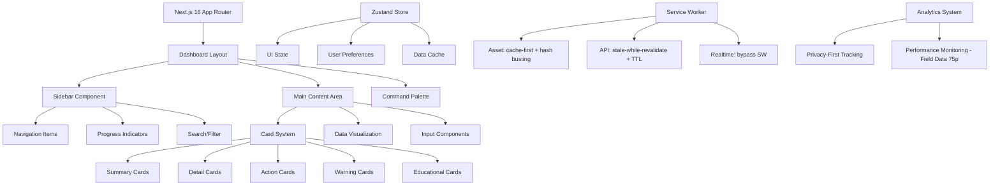

# Design Document - Tradelia SuperBig Dashboard

## Overview

La Tradelia SuperBig Dashboard rappresenta l'evoluzione della dashboard esistente verso standard enterprise di livello Google/Apple/Microsoft, mantenendo i principi fondamentali Tradelia 2026. Il design si concentra su performance eccezionali, accessibilità oltre WCAG AAA, e un'esperienza utente che ispira fiducia istituzionale.

### Design Philosophy

**Principio Guida**: "Se non è abbastanza buono per Google Workspace, non è abbastanza buono per Tradelia."

- **Chiarezza > Persuasione**: Ogni elemento UI serve a chiarificare, non a convincere
- **Verificabilità > Opinione**: Dati tracciabili, fonti visibili, metodologia trasparente
- **Neutralità > Bias**: Palette desaturata, linguaggio accademico, focus su comprensione

### Target Performance (2026 Standards)

**Pass (Industry Standard - 75th percentile field data):**
- **LCP**: ≤ 2.5s (Good per CWV)
- **INP**: ≤ 200ms (Good per CWV) 
- **CLS**: ≤ 0.1 (Good per CWV)

**Elite (Tradelia SuperBig - Stretch Goals):**
- **LCP**: < 1.5s (Google/Stripe level)
- **INP**: < 100ms (Apple level)
- **CLS**: < 0.05 (Microsoft level)
- **Contrast**: 8:1 (WCAG AAA+ internal standard)

## Architecture

### High-Level Architecture



### Modular Architecture (SuperBig Tech Level)

**Feature-Based Structure:**
```
app/ (routes, layouts, metadata, loading/error)
├── [locale]/
│   ├── layout.tsx (i18n setup, theme provider)
│   ├── (dashboard)/
│   │   ├── dashboard/
│   │   │   ├── page.tsx
│   │   │   ├── loading.tsx
│   │   │   └── error.tsx
│   │   └── layout.tsx
│   └── not-found.tsx

src/
├── shared/ (ui primitives, tokens, lib, config)
│   ├── ui/ (Button, Input, Modal, Toast)
│   ├── lib/ (format, validation, constants)
│   ├── config/ (theme, i18n, analytics)
│   └── types/ (global TypeScript definitions)
│
├── entities/ (domain models - zero UI strings)
│   ├── asset/ (Asset, AssetPrice, AssetMetadata)
│   ├── market/ (MarketSnapshot, MarketRegime)
│   ├── risk/ (RiskProfile, RiskMetrics)
│   └── screener/ (ScreenerResult, ScreenerCriteria)
│
├── features/ (user actions - use t() for strings)
│   ├── sidebar-state/ (SidebarToggle, SidebarPersistence)
│   ├── command-palette/ (CommandSearch, CommandHistory)
│   ├── widget-reorder/ (DragDrop, LayoutPersistence)
│   ├── notification-center/ (NotificationList, NotificationPrefs)
│   └── theme-switcher/ (ThemeToggle, ThemeSync)
│
├── widgets/ (large UI blocks - compose features)
│   ├── dashboard-shell/ (main layout composition)
│   ├── sidebar/ (navigation + state management)
│   ├── header/ (logo, command trigger, user menu)
│   └── card-grid/ (card layout + drag/drop)
│
├── processes/ (cross-cutting concerns)
│   ├── sync-offline/ (IndexedDB, sync strategies)
│   ├── cross-device-prefs/ (user preferences sync)
│   └── websocket-polling/ (real-time updates)
│
└── server/ (server-side helpers)
    ├── api/ (route handlers, adapters)
    ├── cache/ (caching policies, invalidation)
    └── security/ (auth, validation, sanitization)
```

**Architecture Rules (Enforced):**
1. **App Router è solo composition**: Niente logica business in app/
2. **Server/Client boundary esplicito**: Chiara separazione server vs client code
3. **Shared UI davvero shared**: Se conosce domini, non è shared
4. **Data layer unico**: Un posto per schemas, API clients, caching
5. **No utils generici**: Ogni util ha un owner specifico
6. **Import restrictions**: ESLint boundaries + path aliases

**Internationalization Architecture:**
- **Routing**: app/[locale]/... pattern con next-intl
- **Message loading**: Per-locale + per-namespace (common/dashboard/errors)
- **Formatting**: Intl APIs per numbers/dates/currency
- **A11y language**: `<html lang>` + `lang` per parti diverse (WCAG 3.1.1/3.1.2)
- **Fallback**: defaultLocale + key-missing reporting in CI

### Component Hierarchy

```
DashboardLayout
├── DashboardHeader
│   ├── Logo
│   ├── CommandPaletteTrigger
│   ├── NotificationCenter
│   └── UserMenu
├── DashboardSidebar
│   ├── NavigationItems
│   ├── ProgressIndicators
│   └── SearchFilter
├── MainContent
│   ├── CardGrid
│   │   ├── SummaryCard
│   │   ├── DetailCard
│   │   ├── ActionCard
│   │   ├── WarningCard
│   │   └── EducationalCard
│   ├── DataVisualization
│   └── InputComponents
├── CommandPalette
└── NotificationSystem
```

## Components and Interfaces

### 1. Dashboard Layout System

#### DashboardLayout Component
```typescript
interface DashboardLayoutProps {
  children: React.ReactNode;
  sidebarState: 'expanded' | 'compact' | 'hidden';
  onSidebarStateChange: (state: SidebarState) => void;
}

interface LayoutState {
  sidebarState: SidebarState;
  theme: 'light' | 'dark' | 'auto';
  density: 'compact' | 'comfortable' | 'spacious';
  reducedMotion: boolean;
}
```

**Responsive Grid System:**
- Breakpoints: 320px, 768px, 1024px, 1440px, 1920px
- Container queries per component-level responsiveness
- CSS Grid + Flexbox per layout complessi
- Fluid typography con clamp() per scaling perfetto

### 2. Sidebar Intelligente Multi-Stato

#### Sidebar Component
```typescript
interface SidebarProps {
  state: 'expanded' | 'compact' | 'hidden';
  navigationItems: NavigationItem[];
  onStateChange: (state: SidebarState) => void;
  showProgressIndicators: boolean;
}

interface NavigationItem {
  id: string;
  label: string;
  icon: React.ComponentType;
  href: string;
  isActive: boolean;
  progress?: number; // 0-100 per progress indicators
  children?: NavigationItem[];
}
```

**Stati e Dimensioni:**
- **Expanded**: 280px - Navigazione completa con labels
- **Compact**: 72px - Solo icone con tooltips intelligenti
- **Hidden**: 0px - Completamente nascosta

**Features:**
- Persistenza stato con localStorage per device
- Sync cross-device per utenti autenticati tramite sync server-side
- Tooltips intelligenti con positioning ottimale
- Keyboard navigation completa
- Search/filter per navigation items
- Progress indicators per sezioni incomplete

### 3. Sistema Card Modulare Avanzato

#### Card Base Component
```typescript
interface CardProps {
  type: 'summary' | 'detail' | 'action' | 'warning' | 'educational';
  title: string;
  subtitle?: string;
  children: React.ReactNode;
  isLoading?: boolean;
  isError?: boolean;
  onRetry?: () => void;
  isDraggable?: boolean;
  isExpandable?: boolean;
  lastUpdated?: Date;
  dataSource?: string;
}

interface CardState {
  isExpanded: boolean;
  isHovered: boolean;
  isDragging: boolean;
  position: { x: number; y: number };
}
```

**Tipologie Card:**

1. **Summary Card**: Metriche chiave, KPI, overview
2. **Detail Card**: Informazioni approfondite, tabelle, liste
3. **Action Card**: CTA, form, operazioni utente
4. **Warning Card**: Errori, alert, notifiche critiche
5. **Educational Card**: Spiegazioni, metodologia, fonti

**Features:**
- Drag & drop reordering con visual feedback
- Expand/collapse states con animazioni fluide (150ms)
- Loading states con skeleton UI
- Hover states con elevation e micro-interactions
- Error states con recovery actions
- Data freshness indicators

### 4. Micro-Interactions di Livello Apple

#### Animation System
```typescript
interface AnimationConfig {
  duration: number; // 150ms default
  easing: string; // cubic-bezier(0.4, 0, 0.2, 1)
  respectReducedMotion: boolean;
}

interface MicroInteraction {
  hover: {
    transform: 'translateY(-1px)';
    boxShadow: 'elevated';
  };
  focus: {
    ring: '2px ring-primary/60 ring-offset-2';
  };
  press: {
    transform: 'scale(0.98)';
  };
  success: {
    animation: 'subtle-pulse';
  };
  error: {
    animation: 'subtle-shake';
  };
}
```

**Timing e Easing:**
- Durata standard: 150ms
- Easing: cubic-bezier(0.4, 0, 0.2, 1)
- Rispetto per prefers-reduced-motion
- Ripple effects per touch interactions

### 5. Sistema di Stato Globale Intelligente

#### Zustand Store Structure
```typescript
interface DashboardState {
  // UI State
  ui: {
    sidebarState: SidebarState;
    theme: ThemeMode;
    density: DensityMode;
    commandPaletteOpen: boolean;
    notifications: Notification[];
  };
  
  // User Preferences
  preferences: {
    language: 'it' | 'en';
    timezone: string;
    dateFormat: string;
    numberFormat: string;
    reducedMotion: boolean;
  };
  
  // Data Cache
  cache: {
    dashboardData: DashboardData;
    lastFetch: Date;
    isStale: boolean;
  };
  
  // Offline State
  offline: {
    isOnline: boolean;
    pendingActions: Action[];
    syncStatus: 'synced' | 'pending' | 'error';
  };
}
```

**Features:**
- Persistenza con IndexedDB per offline support
- Sync cross-device per utenti autenticati
- Optimistic updates per perceived performance
- Undo/redo per azioni critiche
- Intelligent cache invalidation

### 6. Componenti di Input Enterprise

#### Input Component System
```typescript
interface InputProps {
  type: 'text' | 'email' | 'password' | 'number' | 'search';
  label: string;
  placeholder?: string;
  value: string;
  onChange: (value: string) => void;
  validation?: ValidationRule[];
  autoComplete?: string;
  showCharacterCount?: boolean;
  maxLength?: number;
  floatingLabel?: boolean;
}

interface ValidationRule {
  type: 'required' | 'email' | 'minLength' | 'maxLength' | 'pattern';
  value?: string | number;
  message: string;
}
```

**Features:**
- Real-time validation con debouncing (300ms)
- Floating labels con animazioni fluide
- Autocomplete intelligente
- Paste detection e formatting automatico
- Character count e limits
- Keyboard shortcuts per power users

### 7. Sistema di Notifiche Non-Invasivo

#### Notification System
```typescript
interface Notification {
  id: string;
  type: 'info' | 'success' | 'warning' | 'error';
  title: string;
  message: string;
  actions?: NotificationAction[];
  autoDissmiss?: boolean;
  duration?: number; // ms
  timestamp: Date;
}

interface NotificationAction {
  label: string;
  action: () => void;
  style: 'primary' | 'secondary';
}
```

**Features:**
- Toast notifications con auto-dismiss
- Position: top-right con stacking
- Action buttons per quick actions
- Notification center per cronologia
- User preferences per frequency e types
- Screen reader announcements

### 8. Data Visualization Accademica

#### Chart System
```typescript
interface ChartProps {
  type: 'line' | 'bar' | 'pie' | 'scatter' | 'heatmap';
  data: ChartData[];
  title: string;
  subtitle?: string;
  dataSource: string;
  methodology?: string;
  confidenceInterval?: boolean;
  colorblindFriendly?: boolean;
  exportFormats?: ('png' | 'svg' | 'pdf')[];
}

interface ChartData {
  x: string | number;
  y: string | number;
  category?: string;
  confidence?: [number, number]; // [min, max]
  source?: string;
}
```

**Features:**
- Recharts o D3.js per implementazione
- Data sources e methodology visibili
- Interactive tooltips con context
- Colorblind-friendly palettes
- Zoom e pan per detailed analysis
- Export functionality (PNG, SVG, PDF)
- Screen reader compatibility

### 9. Command Palette

#### Command Palette System
```typescript
interface CommandPaletteProps {
  isOpen: boolean;
  onClose: () => void;
  commands: Command[];
  recentCommands: Command[];
  onExecute: (command: Command) => void;
}

interface Command {
  id: string;
  label: string;
  description?: string;
  category: string;
  keywords: string[];
  shortcut?: string;
  icon?: React.ComponentType;
  action: () => void;
}
```

**Features:**
- Apertura con Cmd/Ctrl+K
- Fuzzy search per navigation e actions
- Recent actions e suggestions
- Keyboard navigation completa
- Action categories con visual grouping
- Search history con persistence

### 10. Theming e Personalizzazione

#### Theme System
```typescript
interface ThemeConfig {
  mode: 'light' | 'dark' | 'auto';
  density: 'compact' | 'comfortable' | 'spacious';
  contrast: 'normal' | 'high';
  reducedMotion: boolean;
  customProperties: Record<string, string>;
}

interface ColorPalette {
  background: string;
  foreground: string;
  primary: string;
  muted: string;
  mutedForeground: string;
  border: string;
  // Semantic colors
  success: string;
  warning: string;
  error: string;
  info: string;
}
```

**Palette Colori (Tradelia 2026):**

**Light Mode:**
```css
--background: 0 0% 99%;           /* Bianco caldo */
--foreground: 220 15% 12%;        /* Grigio scuro blu */
--primary: 215 50% 45%;           /* Blu desaturato istituzionale */
--muted: 220 10% 96%;             /* Grigio chiaro */
--muted-foreground: 220 10% 40%;  /* Grigio medio (8:1 contrast - WCAG AAA+ internal) */
--border: 220 10% 88%;            /* Grigio sottile */
```

**Dark Mode:**
```css
--background: 220 15% 8%;
--foreground: 220 10% 95%;
--primary: 215 55% 55%;
--muted: 220 15% 15%;
--muted-foreground: 220 10% 60%;
--border: 220 15% 20%;
```

## Data Models

### Dashboard Data Model
```typescript
interface DashboardData {
  user: UserProfile;
  widgets: Widget[];
  preferences: UserPreferences;
  analytics: AnalyticsData;
  notifications: Notification[];
  lastSync: Date;
}

interface UserProfile {
  id: string;
  email: string;
  name: string;
  avatar?: string;
  role: 'user' | 'admin';
  preferences: UserPreferences;
  createdAt: Date;
  lastActive: Date;
}

interface Widget {
  id: string;
  type: CardType;
  title: string;
  data: WidgetData;
  position: { x: number; y: number };
  size: { width: number; height: number };
  isVisible: boolean;
  lastUpdated: Date;
}

interface UserPreferences {
  theme: ThemeMode;
  language: 'it' | 'en';
  density: DensityMode;
  sidebarState: SidebarState;
  notifications: NotificationPreferences;
  accessibility: AccessibilityPreferences;
}
```

### State Management Model
```typescript
interface AppState {
  // Persistent State (IndexedDB)
  persistent: {
    userPreferences: UserPreferences;
    dashboardLayout: LayoutConfig;
    offlineData: OfflineData;
  };
  
  // Session State (Memory)
  session: {
    currentUser: UserProfile;
    uiState: UIState;
    cache: CacheState;
  };
  
  // Real-time State (WebSocket)
  realtime: {
    notifications: Notification[];
    systemStatus: SystemStatus;
    collaborativeState: CollaborativeState;
  };
}
```

## Correctness Properties

*A property is a characteristic or behavior that should hold true across all valid executions of a system—essentially, a formal statement about what the system should do. Properties serve as the bridge between human-readable specifications and machine-verifiable correctness guarantees.*

### Property Reflection

After analyzing all acceptance criteria, I've identified several areas where properties can be consolidated to eliminate redundancy:

- **Layout and Responsiveness**: Multiple criteria about responsive behavior can be combined into comprehensive layout properties
- **Accessibility**: Various accessibility requirements can be grouped into cohesive accessibility properties  
- **Performance**: Different performance metrics can be unified into comprehensive performance properties
- **State Management**: Various state-related criteria can be combined into state consistency properties
- **User Interface**: Multiple UI behavior criteria can be consolidated into comprehensive interaction properties

### Core Properties

#### Property 1: Responsive Layout Consistency
*For any* viewport size between 320px and 1920px, the dashboard layout should adapt correctly using the enterprise grid system, maintain readable typography through fluid scaling, and support zoom levels from 50% to 200% without layout breaks.
**Validates: Requirements 1.1, 1.2, 1.3, 1.7**

#### Property 2: Sidebar State Management
*For any* sidebar state transition (expanded ↔ compact ↔ hidden), the sidebar should maintain correct dimensions (280px/72px/0px), persist the state across sessions, and provide appropriate navigation feedback including tooltips in compact mode.
**Validates: Requirements 2.1, 2.2, 2.3, 2.5**

#### Property 3: Card System Integrity
*For any* card type (Summary, Detail, Action, Warning, Educational), the card should support all required states (loading, error, expanded, collapsed), maintain consistent interaction patterns, and provide appropriate accessibility announcements.
**Validates: Requirements 3.1, 3.3, 3.4, 3.5, 3.6, 3.7**

#### Property 4: Micro-Interaction Consistency
*For any* interactive element, hover states should apply translateY(-1px) with shadow, focus states should show ring-2 ring-primary/60 ring-offset-2, and all animations should use 150ms timing with cubic-bezier(0.4, 0, 0.2, 1) easing while respecting prefers-reduced-motion.
**Validates: Requirements 4.1, 4.2, 4.3, 4.4, 4.5**

#### Property 5a: Performance Budget Compliance (Pass)
*For any* page load or interaction, the dashboard should achieve LCP < 2.5s, INP < 200ms, and CLS < 0.1 (CWV "Good" thresholds), measured on field data 75th percentile.
**Validates: Requirements 5.1, 5.2, 5.3 (Pass level)**

#### Property 5b: Performance Budget Excellence (Elite)
*For any* page load or interaction, the dashboard should achieve LCP < 1.5s, INP < 100ms, and CLS < 0.05 (SuperBig tech level), while implementing code splitting, service worker caching, and virtual scrolling.
**Validates: Requirements 5.1, 5.2, 5.3 (Elite level), 5.4, 5.6, 5.8**

#### Property 6: Accessibility Excellence (WCAG AAA+)
*For any* text element, the contrast ratio should be WCAG 2.2 AAA (7:1) + requisiti interni (8:1), all interactive elements should be keyboard navigable, dynamic content changes should be announced via live regions, and reduced motion alternatives should be provided for all animations.
**Validates: Requirements 6.1, 6.2, 6.3, 6.4, 6.5, 6.8**

#### Property 7: State Persistence and Synchronization
*For any* critical user state (preferences, layout, data), the state should persist to IndexedDB, sync across devices for authenticated users, support optimistic updates, and handle offline/online transitions gracefully.
**Validates: Requirements 7.2, 7.3, 7.4, 7.5, 7.6**

#### Property 8: Input Validation and Feedback
*For any* input component, real-time validation should occur with appropriate debouncing, validation states should display with correct colors and icons, floating labels should animate smoothly, and character counts should be accurate where applicable.
**Validates: Requirements 8.1, 8.2, 8.4, 8.5, 8.6**

#### Property 9: Notification System Behavior
*For any* notification (info, success, warning, error), it should appear in the top-right with correct stacking, auto-dismiss appropriately, support action buttons, and be announced to screen readers.
**Validates: Requirements 9.1, 9.2, 9.3, 9.4, 9.8**

#### Property 10: Data Visualization Accuracy
*For any* chart or visualization, it should display data sources and methodology, use colorblind-friendly palettes, support interactive tooltips with context, and be accessible to screen readers with appropriate data announcements.
**Validates: Requirements 10.2, 10.3, 10.4, 10.8**

#### Property 11: Command Palette Functionality
*For any* command palette interaction, it should open with Cmd/Ctrl+K, support fuzzy search across all commands, maintain search history, and be fully keyboard navigable with visual grouping by category.
**Validates: Requirements 11.1, 11.2, 11.4, 11.5, 11.7**

#### Property 12: Theme System Consistency
*For any* theme mode (light, dark, auto), the system should maintain WCAG AAA contrast ratios, transition smoothly in 300ms, persist user preferences, and maintain brand consistency across all theme variants.
**Validates: Requirements 12.1, 12.2, 12.3, 12.5, 12.8**

#### Property 13: Error Handling and Recovery
*For any* error condition, the system should display user-friendly messages with suggested actions, implement retry mechanisms with exponential backoff, log errors without exposing sensitive data, and provide graceful degradation.
**Validates: Requirements 13.1, 13.2, 13.3, 13.4, 13.7**

#### Property 14: Privacy-First Analytics
*For any* analytics data collection, the system should exclude personally identifiable information, respect DNT headers and privacy preferences, implement proper consent management, and provide real-time monitoring of critical metrics.
**Validates: Requirements 14.1, 14.5, 14.6, 14.8**

#### Property 15: Internationalization Round-Trip
*For any* supported locale (IT, EN), number/date/currency formatting should be locale-appropriate, pluralization rules should work correctly, locale switching should occur without reload, and fallback strategies should handle missing translations.
**Validates: Requirements 15.3, 15.4, 15.5, 15.8**

## Error Handling

### Error Boundary Strategy

```typescript
interface ErrorBoundaryState {
  hasError: boolean;
  error: Error | null;
  errorInfo: ErrorInfo | null;
  retryCount: number;
}

interface ErrorRecoveryAction {
  label: string;
  action: () => void;
  type: 'retry' | 'reset' | 'navigate' | 'report';
}
```

**Error Categories:**
1. **Network Errors**: Retry with exponential backoff, show offline indicators
2. **Validation Errors**: Real-time feedback, suggested corrections
3. **Permission Errors**: Clear messaging, alternative actions
4. **System Errors**: Graceful degradation, error reporting
5. **Data Errors**: Fallback content, refresh options

### Offline Handling

**Offline-First Strategy:**
- Critical data cached in IndexedDB
- Queue actions for sync when online
- Clear offline indicators
- Graceful feature degradation
- Automatic retry on reconnection

### Error Logging

```typescript
interface ErrorLog {
  id: string;
  timestamp: Date;
  level: 'error' | 'warning' | 'info';
  message: string;
  stack?: string;
  userAgent: string;
  url: string;
  userId?: string; // Only if authenticated, no PII
  sessionId: string;
  buildVersion: string;
}
```

## Testing Strategy

### Dual Testing Approach

The testing strategy combines **unit tests** and **property-based tests** for comprehensive coverage:

**Unit Tests:**
- Specific examples and edge cases
- Integration points between components
- Error conditions and recovery scenarios
- Accessibility compliance verification

**Property-Based Tests:**
- Universal properties across all inputs
- Comprehensive input coverage through randomization
- Performance characteristics under load
- Cross-browser compatibility validation

### Property-Based Testing Configuration

**Framework**: Fast-check for TypeScript/JavaScript property-based testing
**Minimum Iterations**: 100 per property test
**Test Tagging**: Each property test must reference its design document property

**Example Property Test Structure:**
```typescript
// Feature: tradelia-superbig-dashboard, Property 1: Responsive Layout Consistency
describe('Responsive Layout Consistency', () => {
  it('should adapt correctly across all viewport sizes', () => {
    fc.assert(fc.property(
      fc.integer({ min: 320, max: 1920 }), // viewport width
      fc.integer({ min: 568, max: 1080 }), // viewport height
      (width, height) => {
        // Test implementation
        const layout = renderDashboard({ viewport: { width, height } });
        expect(layout.isResponsive()).toBe(true);
        expect(layout.hasLayoutBreaks()).toBe(false);
      }
    ), { numRuns: 100 });
  });
});
```

### Testing Categories

**Performance Testing:**
- Core Web Vitals monitoring (LCP, INP, CLS)
- Bundle size analysis
- Memory usage profiling
- Battery impact measurement

**Accessibility Testing:**
- Automated axe-core testing
- Manual screen reader testing (NVDA, JAWS, VoiceOver)
- Keyboard navigation verification
- Color contrast validation

**Cross-Browser Testing:**
- Chrome, Firefox, Safari, Edge
- Mobile browsers (iOS Safari, Chrome Mobile)
- Assistive technology compatibility

**Integration Testing:**
- API integration points
- State synchronization across devices
- Offline/online transitions
- Real-time updates via WebSocket

### Continuous Testing

**Pre-commit Hooks:**
- Unit test execution
- Accessibility checks
- Performance budget validation
- Code quality metrics

**CI/CD Pipeline:**
- Full test suite execution
- Cross-browser testing
- Performance regression detection
- Accessibility compliance verification

**Production Monitoring:**
- Real User Monitoring (RUM)
- Error tracking and alerting
- Performance metrics collection
- User experience analytics

## Implementation Notes

### Development Workflow

1. **Component-First Development**: Build components in isolation with Storybook
2. **Accessibility-First**: Implement accessibility from the start, not as an afterthought
3. **Performance Budget**: Monitor bundle size and performance metrics continuously
4. **Progressive Enhancement**: Ensure core functionality works without JavaScript

### Code Organization (SuperBig Modular Structure)

```
app/ (Next.js App Router - composition only)
├── [locale]/
│   ├── layout.tsx (i18n, theme providers)
│   ├── (dashboard)/
│   │   ├── dashboard/page.tsx
│   │   ├── dashboard/loading.tsx
│   │   ├── dashboard/error.tsx
│   │   └── layout.tsx
│   └── not-found.tsx

src/ (feature-based modular architecture)
├── shared/ (truly shared, domain-agnostic)
│   ├── ui/ (Button, Input, Modal, Toast)
│   │   ├── Button.tsx
│   │   ├── Input.tsx
│   │   ├── CommandPalette.tsx
│   │   └── __tests__/
│   ├── lib/ (format, validation, constants)
│   │   ├── format.ts
│   │   ├── validation.ts
│   │   ├── accessibility.ts
│   │   └── __tests__/
│   └── config/ (theme, i18n, analytics)
│
├── entities/ (domain models - zero UI strings)
│   ├── asset/
│   │   ├── types.ts
│   │   ├── lib/
│   │   └── __tests__/
│   ├── market/
│   ├── risk/
│   └── screener/
│
├── features/ (user actions - use t() for strings)
│   ├── sidebar-state/
│   │   ├── components/
│   │   ├── hooks/
│   │   ├── store/
│   │   └── __tests__/
│   ├── command-palette/
│   ├── widget-reorder/
│   ├── notification-center/
│   └── theme-switcher/
│
├── widgets/ (large UI blocks)
│   ├── dashboard-shell/
│   │   ├── DashboardLayout.tsx
│   │   ├── DashboardShell.tsx
│   │   └── __tests__/
│   ├── sidebar/
│   │   ├── DashboardSidebar.tsx
│   │   ├── NavigationItems.tsx
│   │   └── __tests__/
│   ├── header/
│   │   ├── DashboardHeader.tsx
│   │   └── __tests__/
│   └── card-grid/
│
├── processes/ (cross-cutting concerns)
│   ├── sync-offline/
│   ├── cross-device-prefs/
│   └── websocket-polling/
│
└── server/ (server-side helpers)
    ├── api/
    ├── cache/
    └── security/

messages/ (i18n - separate from src)
├── it.json
├── en.json
└── common/
    ├── dashboard.json
    ├── errors.json
    └── glossary.json
```

### Performance Optimization

**Bundle Optimization:**
- Tree shaking for unused code elimination
- Code splitting by route and component
- Dynamic imports for non-critical features
- Service worker for intelligent caching

**Runtime Optimization:**
- React.memo for expensive components
- useMemo and useCallback for expensive computations
- Virtual scrolling for large lists
- Intersection Observer for lazy loading

**Network Optimization:**
- Resource preloading for critical assets
- Image optimization with next/image
- API response caching with React Query
- WebSocket connection pooling

### Security Considerations

**Data Protection:**
- No PII in analytics or error logs
- Secure token storage in httpOnly cookies
- Content Security Policy (CSP) implementation
- XSS protection through proper sanitization

**Privacy Compliance:**
- GDPR-compliant consent management
- DNT header respect
- Data minimization principles
- User data export/deletion capabilities

This design document provides a comprehensive foundation for implementing the Tradelia SuperBig Dashboard with enterprise-level quality, performance, and accessibility standards while maintaining the core Tradelia 2026 principles of clarity, verifiability, and neutrality.