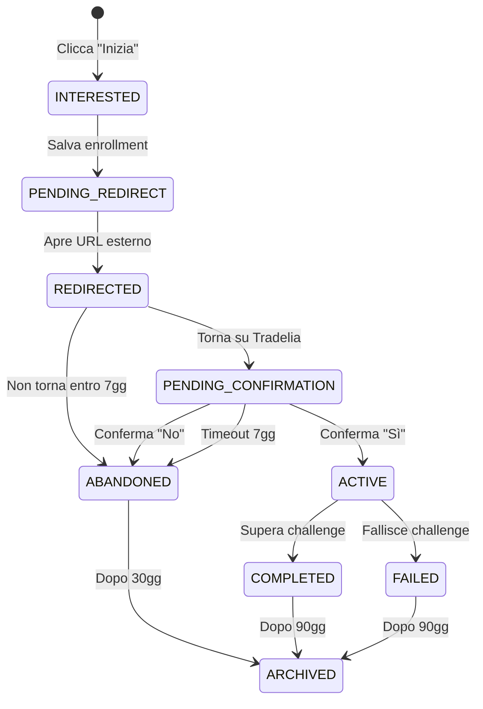

# Architettura Enrollment Flow - Tradelia 2026

## Data: 2026-01-28
## Versione: 1.0 - Enterprise Architecture

---

## 1. Principi Architetturali Tradelia

### Design System Compliance
- **Icone**: SVG custom in [`PremiumIcons.tsx`](src/components/dashboard/challenges/PremiumIcons.tsx)
- **NO EMOJI**: Solo icone SVG craftate
- **Glassmorphism**: `glass-panel`, `backdrop-blur-xl`
- **Colori**: Soft cream palette, gradienti primary
- **Spaziatura**: Enterprise spacing (4-6-8-10)
- **Bordi**: `rounded-xl` (12px), `rounded-2xl` (16px)
- **iOS Safe Area**: `pb-[calc(16px+env(safe-area-inset-bottom))]`

### Pattern Moduli
- **Single Responsibility**: Ogni componente fa una cosa
- **Progressive Disclosure**: Info rilevanti prima
- **Cognitive Load Minimization**: Max 7 elementi per sezione
- **Accessibility**: Focus trap, aria-labels, keyboard nav

---

## 2. Architettura Enrollment Flow

### 2.1 Diagramma dei Stati



### 2.2 Stati Dettagliati

| Stato | Icona | Colore | Badge Text | Azioni Disponibili |
|-------|-------|--------|------------|-------------------|
| `interested` | `ClockIcon` | amber | "In preparazione" | Annulla |
| `pending_redirect` | `ExternalLinkIcon` | blue | "Apri sito ufficiale" | - |
| `pending_confirmation` | `HelpCircleIcon` | orange | "Conferma inizio" | Conferma / Rimuovi |
| `active` | `PlayIcon` | green | "In corso" | View Details / Log Trade |
| `completed` | `TrophyIcon` | emerald | "Completata" | View Summary |
| `failed` | `XCircleIcon` | red | "Fallita" | Retry / Archive |
| `abandoned` | `ArchiveIcon` | gray | "Abbandonata" | Restart / Archive |
| `archived` | `ArchiveIcon` | muted | "Archiviata" | View History |

---

## 3. Componenti UI

### 3.1 Icone SVG da Aggiungere

File: [`PremiumIcons.tsx`](src/components/dashboard/challenges/PremiumIcons.tsx)

```tsx
// Enrollment Status Icons
export const PendingIcon = ({ size = 20, ...props }: IconProps) => (
  <svg width={size} height={size} viewBox="0 0 24 24" fill="none" stroke="currentColor" strokeWidth="2" {...props}>
    <circle cx="12" cy="12" r="10" />
    <polyline points="12 6 12 12 16 14" />
  </svg>
);

export const HelpCircleIcon = ({ size = 20, ...props }: IconProps) => (
  <svg width={size} height={size} viewBox="0 0 24 24" fill="none" stroke="currentColor" strokeWidth="2" {...props}>
    <circle cx="12" cy="12" r="10" />
    <path d="M9.09 9a3 3 0 0 1 5.83 1c0 2-3 3-3 3" />
    <line x1="12" y1="17" x2="12.01" y2="17" />
  </svg>
);

export const PlayIcon = ({ size = 20, ...props }: IconProps) => (
  <svg width={size} height={size} viewBox="0 0 24 24" fill="currentColor" {...props}>
    <polygon points="5 3 19 12 5 21 5 3" />
  </svg>
);

export const XCircleIcon = ({ size = 20, ...props }: IconProps) => (
  <svg width={size} height={size} viewBox="0 0 24 24" fill="none" stroke="currentColor" strokeWidth="2" {...props}>
    <circle cx="12" cy="12" r="10" />
    <line x1="15" y1="9" x2="9" y2="15" />
    <line x1="9" y1="9" x2="15" y2="15" />
  </svg>
);

export const ArchiveIcon = ({ size = 20, ...props }: IconProps) => (
  <svg width={size} height={size} viewBox="0 0 24 24" fill="none" stroke="currentColor" strokeWidth="2" {...props}>
    <polyline points="21 8 21 21 3 21 3 8" />
    <rect x="1" y="3" width="22" height="5" />
    <line x1="10" y1="12" x2="14" y2="12" />
  </svg>
);

export const RedirectIcon = ({ size = 20, ...props }: IconProps) => (
  <svg width={size} height={size} viewBox="0 0 24 24" fill="none" stroke="currentColor" strokeWidth="2" {...props}>
    <path d="M18 13v6a2 2 0 0 1-2 2H5a2 2 0 0 1-2-2V8a2 2 0 0 1 2-2h6" />
    <polyline points="15 3 21 3 21 9" />
    <line x1="10" y1="14" x2="21" y2="3" />
  </svg>
);
```

### 3.2 Componente EnrollmentButton

**File**: `src/components/dashboard/challenges/EnrollmentButton.tsx`

```tsx
'use client';

import { useState } from 'react';
import { useTranslations } from 'next-intl';
import { motion, AnimatePresence } from 'framer-motion';
import { ExternalLinkIcon, RedirectIcon, CheckCircleIcon } from './PremiumIcons';

interface EnrollmentButtonProps {
  programId: string;
  offerId: string;
  officialUrl: string;
  isFree: boolean;
  onEnroll: (programId: string, offerId: string) => Promise<void>;
  className?: string;
}

export function EnrollmentButton({
  programId,
  offerId,
  officialUrl,
  isFree,
  onEnroll,
  className,
}: EnrollmentButtonProps) {
  const t = useTranslations('Challenges.enrollment');
  const [isLoading, setIsLoading] = useState(false);
  const [showConfirmation, setShowConfirmation] = useState(false);

  const handleClick = async () => {
    setIsLoading(true);
    try {
      // 1. Salva enrollment nel DB
      await onEnroll(programId, offerId);
      
      // 2. Mostra modal di conferma
      setShowConfirmation(true);
      
      // 3. Apre URL in nuova tab dopo 1.5s (per dare tempo di vedere il feedback)
      setTimeout(() => {
        window.open(officialUrl, '_blank', 'noopener,noreferrer');
        setShowConfirmation(false);
      }, 1500);
    } catch (error) {
      console.error('Enrollment failed:', error);
    } finally {
      setIsLoading(false);
    }
  };

  return (
    <>
      <motion.button
        onClick={handleClick}
        disabled={isLoading}
        whileHover={{ scale: 1.02 }}
        whileTap={{ scale: 0.98 }}
        className={`
          flex flex-1 items-center justify-center gap-2
          rounded-xl bg-gradient-to-r from-primary to-primary/90
          px-4 py-3 text-sm font-semibold text-primary-foreground
          shadow-lg shadow-primary/20 transition-all
          hover:shadow-xl hover:shadow-primary/30
          disabled:opacity-50 disabled:cursor-not-allowed
          ${className}
        `}
      >
        {isLoading ? (
          <motion.div
            animate={{ rotate: 360 }}
            transition={{ duration: 1, repeat: Infinity, ease: 'linear' }}
            className="size-4 border-2 border-white/30 border-t-white rounded-full"
          />
        ) : (
          <>
            {isFree ? t('joinFree') : t('startChallenge')}
            <ExternalLinkIcon size={16} />
          </>
        )}
      </motion.button>

      {/* Confirmation Modal */}
      <AnimatePresence>
        {showConfirmation && (
          <motion.div
            initial={{ opacity: 0 }}
            animate={{ opacity: 1 }}
            exit={{ opacity: 0 }}
            className="fixed inset-0 z-50 flex items-center justify-center bg-black/50 backdrop-blur-sm"
          >
            <motion.div
              initial={{ scale: 0.9, opacity: 0 }}
              animate={{ scale: 1, opacity: 1 }}
              exit={{ scale: 0.9, opacity: 0 }}
              className="glass-panel max-w-sm rounded-2xl border border-border/50 p-6 text-center shadow-2xl"
            >
              <div className="mx-auto mb-4 flex size-16 items-center justify-center rounded-full bg-primary/10">
                <RedirectIcon size={32} className="text-primary" />
              </div>
              <h3 className="mb-2 text-lg font-bold">{t('redirectTitle')}</h3>
              <p className="mb-4 text-sm text-muted-foreground">
                {t('redirectDescription')}
              </p>
              <div className="flex items-center justify-center gap-2 text-xs text-muted-foreground">
                <div className="size-2 animate-pulse rounded-full bg-primary" />
                {t('redirectingIn')}
              </div>
            </motion.div>
          </motion.div>
        )}
      </AnimatePresence>
    </>
  );
}
```

### 3.3 Componente EnrollmentStatusCard

**File**: `src/components/dashboard/challenges/EnrollmentStatusCard.tsx`

```tsx
'use client';

import { useTranslations } from 'next-intl';
import { motion } from 'framer-motion';
import {
  PendingIcon,
  HelpCircleIcon,
  PlayIcon,
  TrophyIcon,
  XCircleIcon,
  ArchiveIcon,
  CheckCircleIcon,
} from './PremiumIcons';

export type EnrollmentStatus = 
  | 'interested'
  | 'pending_redirect'
  | 'pending_confirmation'
  | 'active'
  | 'completed'
  | 'failed'
  | 'abandoned'
  | 'archived';

interface EnrollmentStatusCardProps {
  status: EnrollmentStatus;
  programName: string;
  offerName: string;
  organizerName: string;
  onConfirm?: () => void;
  onRemove?: () => void;
  onViewDetails?: () => void;
}

const statusConfig = {
  interested: {
    icon: PendingIcon,
    color: 'amber',
    bgColor: 'bg-amber-500/10',
    textColor: 'text-amber-600',
    borderColor: 'border-amber-500/20',
  },
  pending_redirect: {
    icon: PendingIcon,
    color: 'blue',
    bgColor: 'bg-blue-500/10',
    textColor: 'text-blue-600',
    borderColor: 'border-blue-500/20',
  },
  pending_confirmation: {
    icon: HelpCircleIcon,
    color: 'orange',
    bgColor: 'bg-orange-500/10',
    textColor: 'text-orange-600',
    borderColor: 'border-orange-500/20',
  },
  active: {
    icon: PlayIcon,
    color: 'green',
    bgColor: 'bg-green-500/10',
    textColor: 'text-green-600',
    borderColor: 'border-green-500/20',
  },
  completed: {
    icon: TrophyIcon,
    color: 'emerald',
    bgColor: 'bg-emerald-500/10',
    textColor: 'text-emerald-600',
    borderColor: 'border-emerald-500/20',
  },
  failed: {
    icon: XCircleIcon,
    color: 'red',
    bgColor: 'bg-red-500/10',
    textColor: 'text-red-600',
    borderColor: 'border-red-500/20',
  },
  abandoned: {
    icon: ArchiveIcon,
    color: 'gray',
    bgColor: 'bg-gray-500/10',
    textColor: 'text-gray-600',
    borderColor: 'border-gray-500/20',
  },
  archived: {
    icon: ArchiveIcon,
    color: 'muted',
    bgColor: 'bg-muted',
    textColor: 'text-muted-foreground',
    borderColor: 'border-border',
  },
};

export function EnrollmentStatusCard({
  status,
  programName,
  offerName,
  organizerName,
  onConfirm,
  onRemove,
  onViewDetails,
}: EnrollmentStatusCardProps) {
  const t = useTranslations('Challenges.enrollment');
  const config = statusConfig[status];
  const Icon = config.icon;

  return (
    <motion.div
      initial={{ opacity: 0, y: 20 }}
      animate={{ opacity: 1, y: 0 }}
      className={`
        glass-panel rounded-2xl border p-4 sm:p-6
        ${config.borderColor}
        transition-all hover:shadow-lg
      `}
    >
      {/* Header */}
      <div className="mb-4 flex items-start gap-4">
        <div className={`
          flex size-12 shrink-0 items-center justify-center rounded-xl
          ${config.bgColor}
        `}>
          <Icon size={24} className={config.textColor} />
        </div>
        
        <div className="min-w-0 flex-1">
          <h3 className="truncate font-bold">{programName}</h3>
          <p className="text-sm text-muted-foreground">{offerName}</p>
          <p className="text-xs text-muted-foreground">{organizerName}</p>
        </div>

        {/* Status Badge */}
        <span className={`
          shrink-0 rounded-full px-2.5 py-1 text-xs font-semibold
          ${config.bgColor} ${config.textColor}
        `}>
          {t(`status.${status}`)}
        </span>
      </div>

      {/* Actions per Status */}
      {status === 'pending_confirmation' && (
        <div className="flex gap-2">
          <button
            onClick={onConfirm}
            className="flex flex-1 items-center justify-center gap-1.5 rounded-xl bg-green-500 px-3 py-2 text-sm font-semibold text-white transition-all hover:bg-green-600"
          >
            <CheckCircleIcon size={16} />
            {t('confirmStarted')}
          </button>
          <button
            onClick={onRemove}
            className="flex flex-1 items-center justify-center gap-1.5 rounded-xl border border-border bg-background px-3 py-2 text-sm font-semibold transition-all hover:bg-muted"
          >
            <XCircleIcon size={16} />
            {t('remove')}
          </button>
        </div>
      )}

      {status === 'active' && (
        <button
          onClick={onViewDetails}
          className="w-full rounded-xl bg-primary px-3 py-2 text-sm font-semibold text-primary-foreground transition-all hover:bg-primary/90"
        >
          {t('viewDetails')}
        </button>
      )}
    </motion.div>
  );
}
```

### 3.4 Componente PostRedirectBanner

**File**: `src/components/dashboard/challenges/PostRedirectBanner.tsx`

```tsx
'use client';

import { useEffect, useState } from 'react';
import { useTranslations } from 'next-intl';
import { motion, AnimatePresence } from 'framer-motion';
import { HelpCircleIcon, CheckCircleIcon, XCircleIcon } from './PremiumIcons';

interface PostRedirectBannerProps {
  pendingEnrollments: Array<{
    id: string;
    programName: string;
    redirectedAt: string;
  }>;
  onConfirm: (enrollmentId: string) => void;
  onDismiss: (enrollmentId: string) => void;
}

export function PostRedirectBanner({
  pendingEnrollments,
  onConfirm,
  onDismiss,
}: PostRedirectBannerProps) {
  const t = useTranslations('Challenges.enrollment');
  const [isVisible, setIsVisible] = useState(false);

  useEffect(() => {
    // Mostra banner dopo 3 secondi dal caricamento pagina
    const timer = setTimeout(() => {
      if (pendingEnrollments.length > 0) {
        setIsVisible(true);
      }
    }, 3000);

    return () => clearTimeout(timer);
  }, [pendingEnrollments]);

  if (pendingEnrollments.length === 0) return null;

  const enrollment = pendingEnrollments[0]; // Mostra il più recente

  return (
    <AnimatePresence>
      {isVisible && (
        <motion.div
          initial={{ opacity: 0, y: -50 }}
          animate={{ opacity: 1, y: 0 }}
          exit={{ opacity: 0, y: -50 }}
          className="fixed left-0 right-0 top-0 z-50 border-b border-orange-500/20 bg-orange-500/10 backdrop-blur-xl"
        >
          <div className="container mx-auto flex items-center gap-4 px-4 py-3">
            <div className="flex size-10 shrink-0 items-center justify-center rounded-full bg-orange-500/20">
              <HelpCircleIcon size={20} className="text-orange-600" />
            </div>
            
            <div className="min-w-0 flex-1">
              <p className="font-semibold text-orange-900 dark:text-orange-100">
                {t('bannerTitle', { programName: enrollment.programName })}
              </p>
              <p className="text-sm text-orange-800/80 dark:text-orange-200/80">
                {t('bannerDescription')}
              </p>
            </div>

            <div className="flex shrink-0 gap-2">
              <button
                onClick={() => {
                  onConfirm(enrollment.id);
                  setIsVisible(false);
                }}
                className="flex items-center gap-1.5 rounded-lg bg-green-500 px-3 py-1.5 text-sm font-semibold text-white transition-all hover:bg-green-600"
              >
                <CheckCircleIcon size={14} />
                {t('yesStarted')}
              </button>
              <button
                onClick={() => {
                  onDismiss(enrollment.id);
                  setIsVisible(false);
                }}
                className="flex items-center gap-1.5 rounded-lg border border-orange-500/30 bg-white/50 px-3 py-1.5 text-sm font-semibold text-orange-800 transition-all hover:bg-white/80 dark:bg-black/50 dark:text-orange-200"
              >
                <XCircleIcon size={14} />
                {t('notYet')}
              </button>
            </div>
          </div>
        </motion.div>
      )}
    </AnimatePresence>
  );
}
```

---

## 4. API Architecture

### 4.1 Endpoints

```typescript
// POST /api/enrollments
// Crea nuovo enrollment
interface CreateEnrollmentRequest {
  programId: string;
  offerId: string;
}

interface CreateEnrollmentResponse {
  enrollment: {
    id: string;
    status: EnrollmentStatus;
    programName: string;
    officialUrl: string;
  };
}

// GET /api/enrollments
// Lista enrollment utente
interface ListEnrollmentsResponse {
  enrollments: Array<{
    id: string;
    status: EnrollmentStatus;
    program: {
      id: string;
      name: string;
      organizerName: string;
    };
    offer: {
      id: string;
      name: string;
      accountSize: number;
    };
    createdAt: string;
    redirectedAt?: string;
    confirmedAt?: string;
  }>;
}

// PATCH /api/enrollments/:id/confirm
// Conferma inizio challenge
interface ConfirmEnrollmentRequest {
  status: 'active' | 'abandoned';
}

// DELETE /api/enrollments/:id
// Rimuovi enrollment (solo se pending)
```

### 4.2 Database Schema

```sql
-- Enum per status
CREATE TYPE enrollment_status AS ENUM (
  'interested',
  'pending_redirect',
  'pending_confirmation',
  'active',
  'completed',
  'failed',
  'abandoned',
  'archived'
);

-- Tabella enrollments
CREATE TABLE user_enrollments (
  id UUID PRIMARY KEY DEFAULT gen_random_uuid(),
  user_id UUID NOT NULL REFERENCES auth.users(id) ON DELETE CASCADE,
  program_id TEXT NOT NULL REFERENCES programs(id),
  offer_id TEXT NOT NULL REFERENCES offers(id),
  status enrollment_status NOT NULL DEFAULT 'interested',
  
  -- Timestamps
  created_at TIMESTAMP WITH TIME ZONE DEFAULT NOW(),
  clicked_at TIMESTAMP WITH TIME ZONE,
  redirected_at TIMESTAMP WITH TIME ZONE,
  confirmed_at TIMESTAMP WITH TIME ZONE,
  started_at TIMESTAMP WITH TIME ZONE,
  completed_at TIMESTAMP WITH TIME ZONE,
  failed_at TIMESTAMP WITH TIME ZONE,
  abandoned_at TIMESTAMP WITH TIME ZONE,
  archived_at TIMESTAMP WITH TIME ZONE,
  
  -- Metadata
  metadata JSONB DEFAULT '{}',
  
  -- Constraints
  UNIQUE(user_id, program_id, offer_id)
);

-- Indici
CREATE INDEX idx_enrollments_user_id ON user_enrollments(user_id);
CREATE INDEX idx_enrollments_status ON user_enrollments(status);
CREATE INDEX idx_enrollments_user_status ON user_enrollments(user_id, status);

-- RLS Policies
ALTER TABLE user_enrollments ENABLE ROW LEVEL SECURITY;

CREATE POLICY "Users can view own enrollments"
  ON user_enrollments FOR SELECT
  USING (auth.uid() = user_id);

CREATE POLICY "Users can create own enrollments"
  ON user_enrollments FOR INSERT
  WITH CHECK (auth.uid() = user_id);

CREATE POLICY "Users can update own enrollments"
  ON user_enrollments FOR UPDATE
  USING (auth.uid() = user_id);

CREATE POLICY "Users can delete own pending enrollments"
  ON user_enrollments FOR DELETE
  USING (auth.uid() = user_id AND status IN ('interested', 'pending_redirect', 'pending_confirmation'));
```

---

## 5. Piano Implementazione

### Fase 1: Foundation (Giorno 1)
- [ ] Creare tabella `user_enrollments` con migration
- [ ] Creare enum `EnrollmentStatus`
- [ ] Aggiungere icone SVG mancanti a `PremiumIcons.tsx`

### Fase 2: API (Giorno 1-2)
- [ ] Implementare `POST /api/enrollments`
- [ ] Implementare `GET /api/enrollments`
- [ ] Implementare `PATCH /api/enrollments/:id/confirm`
- [ ] Implementare `DELETE /api/enrollments/:id`
- [ ] Aggiungere RLS policies

### Fase 3: UI Components (Giorno 2)
- [ ] Creare `EnrollmentButton.tsx`
- [ ] Creare `EnrollmentStatusCard.tsx`
- [ ] Creare `PostRedirectBanner.tsx`
- [ ] Aggiungere traduzioni in `messages/it/Challenges.json`

### Fase 4: Integration (Giorno 3)
- [ ] Integrare `EnrollmentButton` in `ProgramDrawer.tsx`
- [ ] Aggiornare `my-challenges/page.tsx` con lista enrollment
- [ ] Aggiungere `PostRedirectBanner` in layout dashboard

### Fase 5: Polish (Giorno 3-4)
- [ ] Testare flusso completo
- [ ] Aggiungere analytics events
- [ ] Ottimizzare performance
- [ ] Code review

---

## 6. Considerazioni Sicurezza

1. **RLS Policies**: Solo utente proprietario può vedere/modificare i propri enrollment
2. **Rate Limiting**: Max 10 enrollment al giorno per utente (prevenire spam)
3. **URL Validation**: Verificare che `officialUrl` sia HTTPS e dominio whitelistato
4. **CSRF Protection**: Usare token per API mutations
5. **Audit Log**: Tracciare tutti i cambi di stato per debugging

---

## 7. Metriche e Analytics

### Eventi da Tracciare
```typescript
// Enrollment funnel
enrollment_initiated      // Clicca pulsante
enrollment_saved          // Salvato nel DB
enrollment_redirected     // Aperto URL esterno
enrollment_returned       // Tornato su Tradelia
enrollment_confirmed      // Confermato inizio
enrollment_abandoned      // Confermato non iniziato
enrollment_removed        // Rimosso dalla lista

// Timing
enrollment_time_to_confirm // Tempo tra redirect e conferma
```

### Dashboard Metriche
- Conversion rate: `confirmed / initiated`
- Abandonment rate: `abandoned / redirected`
- Average time to confirm
- Most popular programs

---

**Prossimo Step**: Implementare Fase 1 (Foundation) - Creare migration database e icone SVG.
