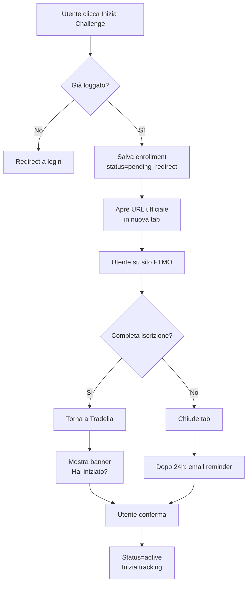

# Ricerca Best Practice: Flusso Enrollment Challenge

## Data: 2026-01-28
## Contesto: Tradelia - Challenge Library

---

## 1. Analisi del Problema

### Scenario Utente
L'utente trova una challenge (es. FTMO Challenge $50K) nella libreria e vuole:
1. Cliccare "Inizia Challenge"
2. Essere reindirizzato al sito ufficiale FTMO
3. Tornare su Tradelia e trovare la challenge in "My Challenges"
4. Confermare manualmente di averla iniziata
5. Iniziare il tracking della challenge

### Problemi da Risolvere
- **Trust**: L'utente deve sentirsi sicuro nel clickare un link esterno
- **Continuità**: Non perdere il contesto dopo il redirect
- **Conferma**: Verificare che l'utente abbia davvero iniziato la challenge
- **UX**: Flusso senza frizioni ma con sicurezza

---

## 2. Best Practice da Ricerca

### A. Pattern "Save Before Redirect" (Booking.com, Airbnb)

**Concetto**: Salvare l'intenzione dell'utente PRIMA del redirect esterno.

**Flusso**:
```
1. Utente clicca "Inizia Challenge"
2. Sistema salva: userId + programId + offerId + timestamp + status="pending_redirect"
3. Sistema apre URL ufficiale in nuova tab
4. Utente completa registrazione sul sito esterno
5. Utente torna su Tradelia → vede challenge in "My Challenges" con badge "In attesa"
6. Utente conferma: "Ho completato l'iscrizione"
7. Status cambia in "active" → inizia tracking
```

**Vantaggi**:
- Non perde mai il contesto
- Può chiudere il tab esterno e tornare dopo
- Tracking dell'abbandono (se non conferma)

**Svantaggi**:
- Richiede conferma manuale (può essere dimenticata)

---

### B. Pattern "Deferred Deep Link" (Apps Flyer, Branch.io)

**Concetto**: Tracciare il percorso utente attraverso il redirect.

**Flusso**:
```
1. Utente clicca "Inizia Challenge"
2. Genera token univoco: enroll_token = hash(userId + programId + timestamp)
3. Salva in DB: token → enrollment_data
4. Redirect a: ftmo.com/?ref=tradelia&token=xyz
5. FTMO (se ha partnership) legge token e conferma
6. Webhook da FTMO a Tradelia: "Utente XYZ ha acquistato"
7. Status automatico: "active"
```

**Vantaggi**:
- Conferma automatica (se c'è partnership)
- Tracking completo del funnel

**Svantaggi**:
- Richiede integrazione con prop firm (difficile)
- Non tutte le prop firm hanno API/webhook

---

### C. Pattern "Wishlist + Reminder" (E-commerce)

**Concetto**: Salvare come "interesse" con reminder.

**Flusso**:
```
1. Utente clicca "Inizia Challenge"
2. Modal: "Aggiungere a My Challenges?"
3. Utente conferma → status="saved"
4. Apre URL in nuova tab
5. Email reminder dopo 24h: "Hai iniziato la challenge?"
6. Utente clicca link email → pagina conferma
7. Status cambia in "active"
```

**Vantaggi**:
- Reminder automatici
- Recupero utenti che dimenticano

**Svantaggi**:
- Più complesso (serve sistema email)
- Può essere invasivo

---

### D. Pattern "Progressive Enrollment" (LinkedIn, Twitter)

**Concetto**: Stati intermedi che guidano l'utente.

**Stati**:
```
INTERESTED → CLICKED → PENDING_CONFIRMATION → ACTIVE
     ↑           ↑            ↑                ↑
   Salvata    Redirect    In attesa        Tracking
   in DB      esterno     conferma         attivo
```

**Flusso**:
```
1. CLICK: Salva stato "clicked" + timestamp
2. REDIRECT: Apre URL in nuova tab
3. RETURN: Utente torna su Tradelia
4. PROMPT: Banner "Hai iniziato la challenge su FTMO?"
5. CONFIRM: Utente clicca "Sì" → stato "active"
6. DECLINE: Utente clicca "No" → stato "abandoned"
```

---

## 3. Analisi Competitor

### FTMO (Prop Firm diretta)
- **Flusso**: Diretto, nessun intermediario
- **Pro**: Semplice
- **Contro**: No tracking esterno

### MyForexFunds (chiusa)
- **Flusso**: Affiliati con tracking link
- **Pro**: Tracciamento conversioni
- **Contro**: Dipende da cookie (problematico)

### TrueForexFunds
- **Flusso**: Coupon code + verifica manuale
- **Pro**: Sconti per utenti
- **Contro**: Friction nell'inserimento codice

### Prop Firm Tracker (competitor diretto)
- **Flusso**: Link diretto, no salvataggio
- **Pro**: Veloce
- **Contro**: Perde tutto se utente non torna

---

## 4. Raccomandazione per Tradelia

### Pattern Ibrido: "Save + Confirm"

Combina i vantaggi di A e D con un tocco di C.

#### Flusso Completo



#### Stati Enrollment

| Stato | Descrizione | Azione Utente | Next State |
|-------|-------------|---------------|------------|
| `interested` | Ha cliccato ma non confermato | Clicca conferma | `pending_redirect` |
| `pending_redirect` | Salvato, redirect aperto | Completa su sito esterno | `pending_confirmation` |
| `pending_confirmation` | Redirect completato, in attesa | Conferma inizio | `active` o `abandoned` |
| `active` | Challenge iniziata, tracking on | Trading normale | `completed` o `failed` |
| `abandoned` | Non ha confermato entro X giorni | - | `archived` |
| `completed` | Challenge superata | Ritira profitti | `funded` |
| `failed` | Challenge fallita | Può riprovare | `archived` |

#### Componenti UI

**1. Drawer - Pulsante CTA**
```
┌─────────────────────────────────────┐
│                                     │
│  [Chiudi]        [Inizia Challenge] │
│                                     │
│  ↳ Aprirà ftmo.com in una nuova tab │
│    e salverà nella tua lista        │
│                                     │
└─────────────────────────────────────┘
```

**2. My Challenges - Card Pending**
```
┌─────────────────────────────────────┐
│  FTMO Challenge $50K                │
│  ⏳ In attesa di conferma           │
│                                     │
│  Hai iniziato questa challenge      │
│  sul sito FTMO?                     │
│                                     │
│  [✅ Sì, ho iniziato]  [❌ No, rimuovi]│
│                                     │
└─────────────────────────────────────┘
```

**3. Banner Post-Redirect**
```
┌─────────────────────────────────────┐
│  🎉 Ben tornato!                    │
│                                     │
│  Hai iniziato la challenge FTMO?    │
│                                     │
│  [Sì, conferma]  [Non ancora]       │
│                                     │
└─────────────────────────────────────┘
```

---

## 5. Considerazioni Tecniche

### Database
```sql
-- Tabella user_enrollments
CREATE TABLE user_enrollments (
  id UUID PRIMARY KEY,
  user_id UUID REFERENCES auth.users(id),
  program_id TEXT REFERENCES programs(id),
  offer_id TEXT REFERENCES offers(id),
  status enrollment_status DEFAULT 'pending_redirect',
  clicked_at TIMESTAMP,
  redirected_at TIMESTAMP,
  confirmed_at TIMESTAMP,
  started_at TIMESTAMP,
  completed_at TIMESTAMP,
  abandoned_at TIMESTAMP,
  metadata JSONB -- per dati extra
);

-- Enum status
CREATE TYPE enrollment_status AS ENUM (
  'interested',
  'pending_redirect',
  'pending_confirmation',
  'active',
  'abandoned',
  'completed',
  'failed',
  'archived'
);
```

### API Endpoints

```typescript
// POST /api/enrollments
// Crea enrollment e ritorna URL redirect
{
  programId: string,
  offerId: string
}

// PATCH /api/enrollments/:id/confirm
// Conferma inizio challenge
{
  status: 'active',
  startedAt: Date
}

// DELETE /api/enrollments/:id
// Rimuovi enrollment (se non iniziata)

// GET /api/enrollments
// Lista challenge utente con filtri per status
```

### Analytics Events

```typescript
// Track ogni step
enrollment_clicked
enrollment_redirected
enrollment_returned
enrollment_confirmed
enrollment_abandoned
enrollment_reminder_sent
```

---

## 6. Metriche di Successo

| Metrica | Target | Descrizione |
|---------|--------|-------------|
| Click-to-Redirect | >80% | % che apre link esterno |
| Redirect-to-Confirm | >40% | % che conferma dopo redirect |
| Time to Confirm | <24h | Tempo medio tra redirect e conferma |
| Abandonment Rate | <30% | % che non conferma entro 7 giorni |
| Reactivation | >15% | % che riattiva da reminder email |

---

## 7. Prossimi Passi

1. **Validare flusso** con utenti di test
2. **Progettare UI** dettagliata (wireframe)
3. **Implementare MVP** con stati base
4. **Aggiungere email** reminder
5. **Iterare** basandosi su analytics

---

## Riferimenti

1. Nielsen Norman Group - "Redirect UX Best Practices"
2. Baymard Institute - "E-commerce Checkout Flow"
3. Refactoring UI - "Designing with State"
4. Growth.design - "User Psychology Patterns"
