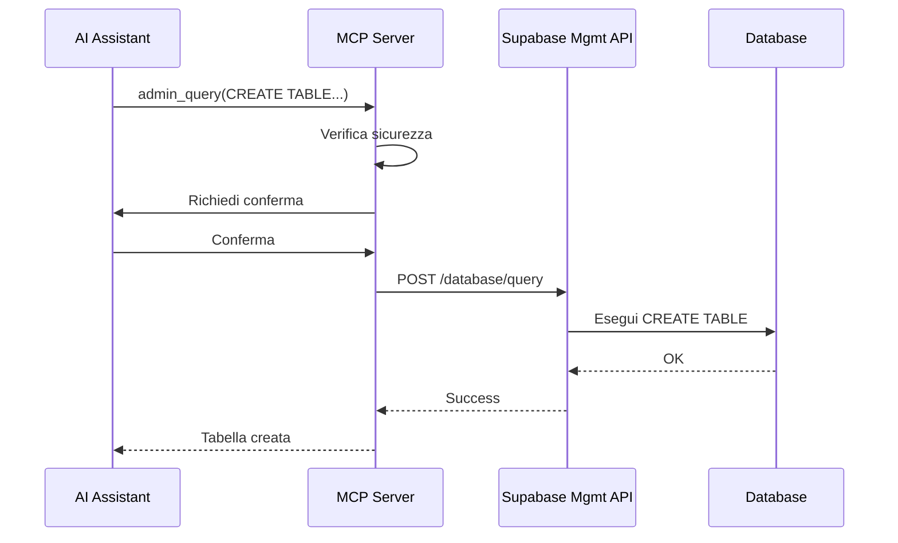
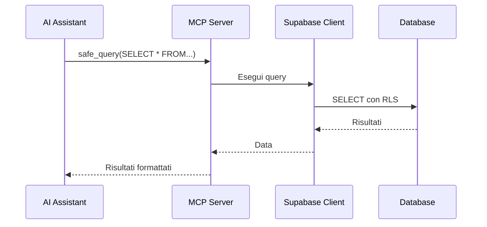

# Gestione Supabase tramite AI in VSCode - Best Practice 2026

## Data: 2026-01-28
## Contesto: Tradelia - Integrazione AI-Supabase

---

## 1. Panoramica delle Soluzioni Disponibili (2026)

### A. MCP (Model Context Protocol) - La Soluzione Standard

**Cos'è**: Protocollo aperto di Anthropic per connettere AI a sistemi esterni

**Vantaggi**:
- ✅ Standard aperto, supportato da multiple AI
- ✅ Comunicazione bidirezionale real-time
- ✅ Tool discovery automatica
- ✅ Sicurezza integrata (stdio-based)
- ✅ Funziona offline (localhost)

**Svantaggi**:
- ❌ Richiede implementazione server MCP
- ❌ Limitazioni di sicurezza (solo SELECT di default)
- ❌ Nessuna funzione SQL arbitraria su Supabase di default

---

### B. Supabase Management API (REST)

**Cos'è**: API REST ufficiale di Supabase per gestione programmatica

**Endpoint Chiave**:
```
POST https://api.supabase.com/v1/projects/{ref}/database/query
POST https://api.supabase.com/v1/projects/{ref}/database/migrations
GET  https://api.supabase.com/v1/projects/{ref}/database/tables
```

**Vantaggi**:
- ✅ API ufficiale, stabile e documentata
- ✅ Supporta query SQL arbitrarie
- ✅ Gestione completa del database
- ✅ Autenticazione via Service Role Key

**Svantaggi**:
- ❌ Richiede Service Role Key (permessi elevati)
- ❌ Rate limiting
- ❌ Non è real-time (richiesta/risposta HTTP)

---

### C. PostgreSQL Direct Connection (psycopg2/node-postgres)

**Cos'è**: Connessione diretta al database PostgreSQL

**Vantaggi**:
- ✅ Controllo completo
- ✅ Nessuna astrazione
- ✅ Performance ottimale

**Svantaggi**:
- ❌ Espone connection string (sicurezza)
- ❌ Richiede gestione pooling
- ❌ No integrazione nativa MCP

---

### D. Supabase CLI + AI Wrapper

**Cos'è**: Wrappare il CLI di Supabase in un tool MCP

**Comandi Chiave**:
```bash
supabase db push          # Applica migrations
supabase db reset         # Reset database
supabase db dump          # Backup
supabase gen types        # Genera TypeScript types
```

**Vantaggi**:
- ✅ Usa tool ufficiale Supabase
- ✅ Gestione migrations nativa
- ✅ Type generation automatica

**Svantaggi**:
- ❌ Richiede Node.js runtime
- ❌ Non è real-time
- ❌ Output parsing complesso

---

## 2. Raccomandazione per Tradelia: Ibrido MCP + Management API

### Architettura Proposta

```
┌─────────────────┐
│   VSCode + AI   │
└────────┬────────┘
         │
    ┌────┴────┐
    │   MCP   │  ← Protocollo standard
    └────┬────┘
         │
    ┌────┴────────────────────────────┐
    │         MCP Server               │
    │  ┌─────────────────────────────┐ │
    │  │  1. Query Tool (SELECT)     │ │  ← Safe operations
    │  │  2. Insert Tool (INSERT)    │ │  ← Safe operations
    │  │  3. Management API Client   │ │  ← Admin operations
    │  └─────────────────────────────┘ │
    └──────────┬───────────────────────┘
               │
        ┌──────┴──────┐
        │             │
   ┌────┴────┐   ┌────┴─────────────┐
   │Supabase │   │ Supabase Mgmt API│
   │  Client │   │ (Service Role)   │
   │ (Anon)  │   │                  │
   └─────────┘   └──────────────────┘
```

### Implementazione Dettagliata

#### Tool 1: Safe Queries (via Supabase Client)
```typescript
// SELECT, INSERT con RLS
server.tool("safe_query", { sql: z.string() }, async ({ sql }) => {
  // Solo SELECT e INSERT semplici
  // Rispetta RLS policies
});
```

#### Tool 2: Management Operations (via Management API)
```typescript
// CREATE, ALTER, DROP, migrations
server.tool("admin_query", { sql: z.string() }, async ({ sql }) => {
  // Usa Management API con Service Role
  // Richiede conferma esplicita
});
```

#### Tool 3: Migrations
```typescript
// Gestione migrations
server.tool("apply_migration", { file: z.string() }, async ({ file }) => {
  // Legge file .sql e applica via Management API
});
```

---

## 3. Configurazione Sicura

### Environment Variables
```bash
# .env (non committare)
SUPABASE_URL=https://higkhlfjfhlecbtfnznx.supabase.co
SUPABASE_ANON_KEY=eyJhbG...        # Per operazioni safe
SUPABASE_SERVICE_ROLE_KEY=eyJ...   # Per operazioni admin (solo server MCP)
SUPABASE_PROJECT_REF=higkhlfjfhlecbtfnznx
```

### Sicurezza
1. **Service Role Key**: Solo nel server MCP, mai nel client
2. **RLS**: Sempre attivo per operazioni utente
3. **Audit Log**: Logga tutte le operazioni admin
4. **Conferma**: Richiedi conferma per DROP/DELETE

---

## 4. Flusso di Lavoro Tipico

### Scenario: Creare Nuova Tabella



### Scenario: Query Dati



---

## 5. Implementazione Pratica

### Opzione A: Estendere Server MCP Esistente

Modifica il server MCP attuale per supportare operazioni admin:

```typescript
// C:/Users/Utente/AppData/Roaming/Kilo-Code/MCP/supabase-server/src/index.ts

// Tool esistente: query (SELECT only)
// Tool esistente: insert_data (INSERT via client)

// NUOVO: Admin operations via Management API
server.tool("admin_query", {
  sql: z.string().describe("SQL query to execute (CREATE, ALTER, DROP)"),
  confirm: z.boolean().default(false).describe("Confirm dangerous operation"),
}, async ({ sql, confirm }) => {
  // 1. Verifica tipo query
  const isDangerous = /drop|delete|truncate/i.test(sql);
  
  if (isDangerous && !confirm) {
    return {
      content: [{ 
        type: "text", 
        text: "⚠️ Dangerous operation detected. Set confirm=true to proceed." 
      }],
      isError: true,
    };
  }
  
  // 2. Chiama Management API
  const response = await fetch(
    `https://api.supabase.com/v1/projects/${PROJECT_REF}/database/query`,
    {
      method: 'POST',
      headers: {
        'Authorization': `Bearer ${SERVICE_ROLE_KEY}`,
        'Content-Type': 'application/json',
      },
      body: JSON.stringify({ query: sql }),
    }
  );
  
  // 3. Ritorna risultato
  const data = await response.json();
  return { content: [{ type: "text", text: JSON.stringify(data, null, 2) }] };
});
```

### Opzione B: Usare Estensione VSCode Esistente

**Supabase VSCode Extension** (ufficiale):
- Gestione database visuale
- SQL Editor integrato
- Migrations management
- Type generation

**AI Integration**: L'AI può generare SQL che l'utente esegue manualmente nell'estensione.

---

## 6. Raccomandazione Finale per Tradelia

### Soluzione Ibrida Consigliata

1. **MCP Server** (quello che abbiamo già):
   - `query`: SELECT operations (con RLS)
   - `insert_data`: INSERT/UPSERT operations
   - `get_schema`: Schema introspection
   - `list_tables`: Table listing

2. **Supabase CLI** (per migrations):
   ```bash
   # AI genera migration file
   # Utente esegue: npx supabase db push
   ```

3. **Supabase Studio** (per operazioni admin complesse):
   - SQL Editor per CREATE/ALTER/DROP
   - Table Editor per modifiche struttura
   - AI genera SQL, utente copia-incolla in Studio

### Workflow Operativo

```
AI Assistant: "Ho bisogno di creare la tabella user_enrollments"
     ↓
AI: Genera SQL migration
     ↓
AI: "Ecco la migration. Vuoi che la applichi?"
     ↓
Utente: "Sì"
     ↓
AI: Salva file in supabase/migrations/0013_...
     ↓
AI: "Esegui: npx supabase db push"
     ↓
Utente: Esegue comando nel terminale VSCode
     ↓
Database: Migration applicata
```

---

## 7. Confronto Rapido

| Metodo | Facilità | Sicurezza | Potenza | Real-time | Raccomandato |
|--------|----------|-----------|---------|-----------|--------------|
| MCP (attuale) | ⭐⭐⭐ | ⭐⭐⭐⭐⭐ | ⭐⭐ | ✅ | ✅ SELECT/INSERT |
| MCP + Mgmt API | ⭐⭐ | ⭐⭐⭐ | ⭐⭐⭐⭐⭐ | ✅ | ✅ Tutto |
| Supabase CLI | ⭐⭐⭐ | ⭐⭐⭐⭐⭐ | ⭐⭐⭐⭐⭐ | ❌ | ✅ Migrations |
| Studio Manuale | ⭐⭐ | ⭐⭐⭐⭐⭐ | ⭐⭐⭐⭐⭐ | ❌ | ✅ Admin ops |
| Direct Postgres | ⭐⭐⭐ | ⭐⭐ | ⭐⭐⭐⭐⭐ | ✅ | ❌ Non sicuro |

---

## 8. Prossimi Passi

Per implementare la soluzione completa:

1. **Aggiungere tool `admin_query`** al server MCP esistente
2. **Configurare Service Role Key** nel server (sicuro, locale)
3. **Testare** con CREATE TABLE semplice
4. **Documentare** workflow per team

Vuoi che proceda con l'implementazione del tool `admin_query` nel server MCP?
