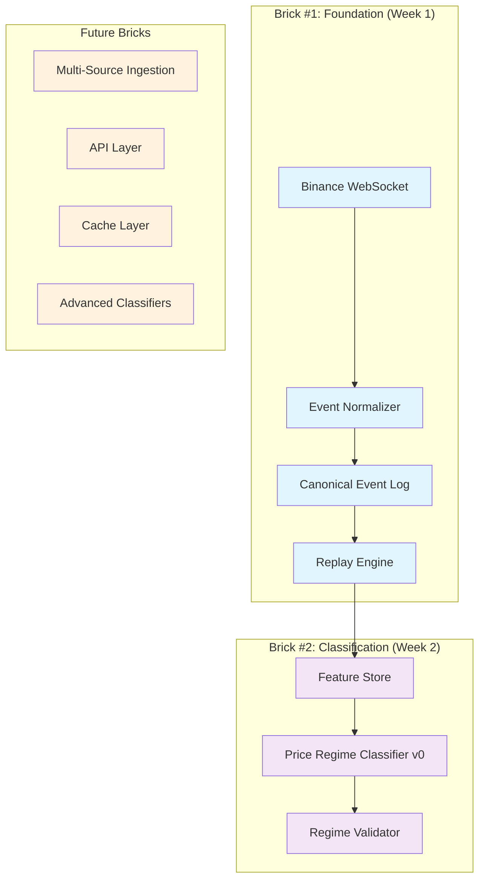

# Market Context Engine (MCE) - Design Document v2

## Overview

Il Market Context Engine implementa il principio fondamentale della ricerca quantitativa: **determinismo assoluto**. Prima di costruire classificatori complessi, stabiliamo una base scientifica solida attraverso Canonical Event Log + Replay Engine.

Questo design segue l'approccio "MAX architecture, progressive activation, free-first" - architettura massimale ma attivazione incrementale, iniziando con il minimo indispensabile e gratuito.

## Architecture Principles

### 1. Deterministic Core
- Same input → Same output (bit-per-bit)
- Determinism is validated on canonical JSON serialization + numeric quantization + stable key order, hashed via SHA-256
- No side effects in calculations
- Immutable event log
- Reproducible replay from any point

### 2. Progressive Activation
- Brick #1: Event Log + Replay (Week 1)
- Brick #2: Price Regime v0 (Week 2)
- Brick #3: Multi-source (Later)
- Brick #4: API/Redis (When needed)

### 3. Financial Robustness
- Scale invariance
- Time monotonicity
- No lookahead leakage
- Regime stability bounds

## System Architecture



## Core Data Models

### EventEnvelope Schema

```typescript
interface EventEnvelope<T = any> {
  v: 1;                           // Schema version
  id: string;                     // ULID/UUID v7 for uniqueness
  seq: number;                    // Monotonic ingest sequence (per source+stream+symbol)
  source: "binance";              // Single source initially
  stream: StreamType;             // kline | funding | open_interest | liquidation
  symbol: string;                 // Canonical format (BTCUSDT)
  ts_event: number;               // Exchange timestamp (ms)
  ts_ingest: number;              // Local monotonic timestamp (ms)
  payload: T;                     // Typed payload
  correlation_id?: string;        // Optional for derived events
}

// Deterministic ordering: (ts_event ASC, ts_ingest ASC, seq ASC)
type DeterministicOrder = [number, number, number]; // [ts_event, ts_ingest, seq]

type StreamType = "kline" | "funding" | "open_interest" | "liquidation";

// Minimal Payloads for Brick #1
interface KlinePayload {
  open: number;
  high: number;
  low: number;
  close: number;
  volume: number;
  interval: string;               // 1m, 5m, 1h, 4h, 1d
  is_final: boolean;              // Kline closed flag
}

interface FundingPayload {
  funding_rate: number;           // Current funding rate
  funding_time: number;           // Funding timestamp
}

interface OpenInterestPayload {
  open_interest: number;          // OI in base currency
  open_interest_value?: number;   // USD value if available
}

interface LiquidationPayload {
  side: "long" | "short";
  qty: number;
  price: number;
  ts: number;                     // Liquidation timestamp
}
```

### Canonical Symbol Mapping

```typescript
interface SymbolMap {
  binance_symbol: string;         // BTCUSDT
  canonical_symbol: string;       // BTCUSDT (standard)
  base_asset: string;             // BTC
  quote_asset: string;            // USDT
  active: boolean;
}

// Standard mapping rules
const SYMBOL_MAPPING = {
  "BTCUSDT": "BTCUSDT",          // Already canonical
  "ETHUSDT": "ETHUSDT",
  "ADAUSDT": "ADAUSDT",
  // Add more as needed
};
```

## Components and Interfaces

### 1. Event Normalizer

```typescript
interface EventNormalizer {
  normalize(rawEvent: any, source: string): EventEnvelope | null;
  validateSchema(event: EventEnvelope): boolean;
  mapSymbol(sourceSymbol: string): string;
  extractTimestamp(rawEvent: any): number;
  calculateChecksum(event: EventEnvelope): string;
}

class BinanceEventNormalizer implements EventNormalizer {
  normalize(rawEvent: any, source: "binance"): EventEnvelope | null {
    // Validate raw event structure
    if (!this.isValidBinanceEvent(rawEvent)) return null;
    
    // Extract and normalize fields
    const symbol = this.mapSymbol(rawEvent.s);
    const ts_event = rawEvent.E || rawEvent.T; // Event time
    const ts_ingest = Date.now();
    
    // Create typed payload based on stream
    const payload = this.createPayload(rawEvent);
    
    return {
      v: 1,
      id: generateULID(),
      seq: this.getNextSequence(),
      source: "binance",
      stream: this.detectStreamType(rawEvent),
      symbol,
      ts_event,
      ts_ingest,
      payload
    };
  }
}
```

### 2. Canonical Event Log

```typescript
interface EventLog {
  append(event: EventEnvelope): Promise<void>;
  query(params: QueryParams): Promise<EventEnvelope[]>;
  getRange(symbol: string, start: number, end: number): Promise<EventEnvelope[]>;
  validateIntegrity(): Promise<boolean>;
  createSnapshot(timestamp: number): Promise<string>;
}

interface QueryParams {
  symbol?: string;
  stream?: StreamType;
  start_time?: number;
  end_time?: number;
  limit?: number;
  order?: "asc" | "desc";
}

class PostgreSQLEventLog implements EventLog {
  async append(event: EventEnvelope): Promise<void> {
    // Validate event schema
    if (!this.validateEvent(event)) {
      throw new Error("Invalid event schema");
    }
    
    // Check for duplicates
    if (await this.isDuplicate(event)) {
      return; // Skip duplicate
    }
    
    // Insert with conflict resolution
    await this.db.query(`
      INSERT INTO events (
        version, id, seq, source, stream, symbol, 
        ts_event, ts_ingest, payload, correlation_id
      ) VALUES ($1, $2, $3, $4, $5, $6, $7, $8, $9, $10)
      ON CONFLICT (source, symbol, stream, ts_event, seq) DO NOTHING
    `, [
      event.v, event.id, event.seq, event.source, event.stream, event.symbol,
      event.ts_event, event.ts_ingest, 
      JSON.stringify(event.payload), event.correlation_id
    ]);
  }
}
```

### 3. Replay Engine with Watermark Algorithm

```typescript
interface ReplayEngine {
  replay(params: ReplayParams): AsyncGenerator<EventEnvelope>;
  createSnapshot(timestamp: number): Promise<SystemSnapshot>;
  loadSnapshot(snapshotId: string): Promise<SystemSnapshot>;
  validateDeterminism(events: EventEnvelope[]): Promise<boolean>;
}

interface ReplayParams {
  symbol: string;
  start_time: number;
  end_time: number;
  reorder_window_ms?: number;    // Default 30000 (30s)
}

class DeterministicReplayEngine implements ReplayEngine {
  private reorderBuffer: EventBuffer;
  private featureStore: FeatureStore;
  private watermark: number = 0;
  private readonly REORDER_WINDOW_MS = 30_000;
  
  async* replay(params: ReplayParams): AsyncGenerator<EventEnvelope> {
    const events = await this.eventLog.getRange(
      params.symbol, 
      params.start_time, 
      params.end_time
    );
    
    // Process events with watermark + reorder buffer
    for (const event of events) {
      await this.processEventWithReordering(event);
      
      // Emit processed events from buffer
      for (const processedEvent of this.drainBuffer()) {
        this.validateTimeOrder(processedEvent);
        await this.featureStore.update(processedEvent);
        yield processedEvent;
      }
    }
    
    // Flush remaining events
    for (const remainingEvent of this.flushBuffer()) {
      yield remainingEvent;
    }
  }
  
  private async processEventWithReordering(event: EventEnvelope): Promise<void> {
    // Update watermark
    this.watermark = Math.max(this.watermark, event.ts_event - this.REORDER_WINDOW_MS);
    
    // Check if event is too late
    if (event.ts_event < this.watermark) {
      event.metadata = { ...event.metadata, late: true };
    }
    
    // Add to reorder buffer
    this.reorderBuffer.add(event);
  }
  
  private drainBuffer(): EventEnvelope[] {
    return this.reorderBuffer.drainUpTo(this.watermark);
  }
  
  private validateTimeOrder(event: EventEnvelope): void {
    const currentTime = this.featureStore.getCurrentTime();
    if (event.ts_event > currentTime) {
      throw new Error(`Lookahead leakage detected: ${event.ts_event} > ${currentTime}`);
    }
  }
}

// Efficient Reorder Buffer Implementation (Fixed Performance Bug)
class EventBuffer {
  private buffer: EventEnvelope[] = [];
  
  add(event: EventEnvelope): void {
    // Binary insert to maintain sorted order - O(log n) instead of O(n log n)
    const insertIndex = this.binarySearchInsertIndex(event);
    this.buffer.splice(insertIndex, 0, event);
  }
  
  private binarySearchInsertIndex(event: EventEnvelope): number {
    let left = 0;
    let right = this.buffer.length;
    
    while (left < right) {
      const mid = Math.floor((left + right) / 2);
      const comparison = this.compareEvents(this.buffer[mid], event);
      
      if (comparison < 0) {
        left = mid + 1;
      } else {
        right = mid;
      }
    }
    
    return left;
  }
  
  private compareEvents(a: EventEnvelope, b: EventEnvelope): number {
    if (a.ts_event !== b.ts_event) return a.ts_event - b.ts_event;
    if (a.ts_ingest !== b.ts_ingest) return a.ts_ingest - b.ts_ingest;
    return a.seq - b.seq;
  }
  
  drainUpTo(watermark: number): EventEnvelope[] {
    const toProcess = this.buffer.filter(e => e.ts_event <= watermark);
    this.buffer = this.buffer.filter(e => e.ts_event > watermark);
    return toProcess;
  }
  
  flushAll(): EventEnvelope[] {
    const all = [...this.buffer];
    this.buffer = [];
    return all;
  }
}
```

### 4. Feature Store

```typescript
interface FeatureStore {
  update(event: EventEnvelope): Promise<void>;
  getFeatures(symbol: string, timestamp: number): Promise<Features>;
  calculateRolling(symbol: string, window: number, stat: StatType): Promise<number>;
  validateNoLookahead(timestamp: number): boolean;
}

interface Features {
  timestamp: number;
  symbol: string;
  price: {
    current: number;
    atr_14: number;
    atr_50: number;
    atr_pct_14: number;           // ATR normalized by price
    trend_h1: TrendDirection;
    trend_h4: TrendDirection;
    trend_d1: TrendDirection;
  };
  volatility: {
    realized_7d: number;
    realized_30d: number;
    percentile_7d: number;        // ATR% percentile in 7d window
    percentile_30d: number;
    regime: VolatilityRegime;
  };
  funding?: {
    current_rate: number;
    zscore_7d: number;
    zscore_30d: number;
    velocity: number;             // Rate of change
  };
  open_interest?: {
    current: number;
    delta_1h: number;
    delta_4h: number;
    delta_24h: number;
  };
}

type TrendDirection = "up" | "down" | "sideways";
type VolatilityRegime = "compressed" | "normal" | "expanded";
type StatType = "mean" | "median" | "std" | "mad" | "percentile";
```

## Error Handling

### Data Quality Issues
- **Missing Events**: Interpolation with quality score penalty
- **Late Events**: Accept within buffer window, mark as late
- **Invalid Schema**: Reject with detailed error logging
- **Duplicate Events**: Idempotent handling, no state corruption

### System Failures
- **Connection Loss**: Exponential backoff reconnection
- **Storage Failures**: Graceful degradation with in-memory buffer
- **Computation Errors**: Fail-fast with detailed error context
- **Memory Issues**: Configurable buffer limits with LRU eviction

### Financial Edge Cases
- **Extreme Price Moves**: Robust statistics (median/MAD) for outlier resistance
- **Market Halts**: Handle gaps in data stream gracefully
- **Regime Transitions**: Smoothing to prevent oscillation
- **Low Liquidity**: Quality score adjustment for thin markets

## Testing Strategy

### Property-Based Testing Framework
- **Library**: fast-check for TypeScript
- **Iterations**: 1000+ per property for thorough coverage
- **Custom Generators**: Realistic market data patterns
- **Shrinking**: Automatic minimal counterexample finding

### Financial Property Tests
```typescript
// Example property test
fc.property(
  fc.array(fc.record({
    price: fc.float(1, 100000),
    timestamp: fc.integer(1600000000000, 1700000000000)
  })),
  (priceData) => {
    // Scale invariance test
    const originalRegime = classifyRegime(priceData);
    const scaledData = priceData.map(p => ({...p, price: p.price * 10}));
    const scaledRegime = classifyRegime(scaledData);
    
    return originalRegime.trend === scaledRegime.trend;
  }
);
```

### Integration Testing
- **End-to-End Replay**: Historical data → identical results
- **Performance Benchmarks**: Latency and throughput metrics
- **Failure Scenarios**: Network issues, data corruption, system restarts
- **Data Quality Validation**: Various market conditions and edge cases

## Implementation Phases

### Phase 0: Foundation (Days 1-2)
- TypeScript project setup
- Zod schemas for EventEnvelope
- PostgreSQL database schema
- Basic testing framework

### Phase 1: Event Pipeline (Days 3-5)
- Binance WebSocket connection
- Event normalization and validation
- Append-only event log
- Basic health metrics

### Phase 2: Replay Engine (Days 6-7)
- Deterministic event replay
- Watermark + reorder buffer algorithm
- System snapshots
- Determinism validation tests

### Phase 3: Feature Store (Week 2)
- Rolling calculations (ATR, percentiles)
- Multi-window feature computation
- No-lookahead validation
- Feature consistency tests

### Phase 4: Price Regime v0 (Week 2)
- Simple volatility + trend classification
- Regime stability validation
- Confidence scoring
- Performance metrics

### Future Phases
- Multi-source ingestion (Bybit)
- Advanced classifiers (Leverage, Behavioral)
- API layer and caching
- Production monitoring

## Performance Considerations

### Memory Management
- **Event Buffer**: Efficient binary insert instead of full sort
- **Feature Cache**: Recent calculations in memory
- **Rolling Windows**: Efficient circular buffers
- **Garbage Collection**: Minimize allocations in hot paths

### Storage Optimization
- **Event Compression**: Historical data beyond 90 days
- **Indexing Strategy**: (symbol, ts_event) composite indexes
- **Partitioning**: Time-based partitions for large datasets
- **Archival**: Cold storage for old events

This design provides a solid, scientifically rigorous foundation that can be extended incrementally while maintaining determinism and financial robustness.