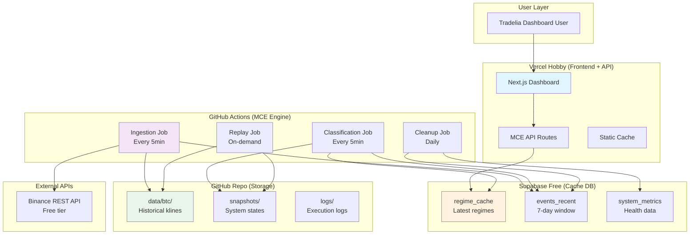

# Market Context Engine - Free Tier Architecture

## Overview

Specifica tecnica per implementare il Market Context Engine utilizzando esclusivamente servizi gratuiti: Vercel Hobby + GitHub Actions + Supabase Free. Architettura ibrida che mantiene i principi di determinismo e robustezza finanziaria del MCE originale, adattati ai vincoli dei free tier.

**Costo Totale: $0/mese** 🎉

## Architecture Components

### 1. Vercel Hobby (Frontend + API Gateway)
- **Role**: Dashboard Tradelia + MCE API endpoints
- **Limits**: 100GB bandwidth, 1000 serverless invocations/day
- **Usage**: Serve cached regime data, no heavy computation

### 2. GitHub Actions (MCE Engine)
- **Role**: Scheduled data ingestion + regime classification
- **Limits**: 2000 minutes/month, runs every 5 minutes
- **Usage**: Batch processing, deterministic replay, file storage

### 3. Supabase Free (Database + Cache)
- **Role**: Recent data cache + regime signatures
- **Limits**: 500MB database, 2GB bandwidth/month
- **Usage**: 7-day rolling window, auto-cleanup

### 4. GitHub Repository (Historical Storage)
- **Role**: Long-term data storage + snapshots
- **Limits**: Unlimited (within reason)
- **Usage**: Compressed historical data, replay snapshots

## System Architecture



## Data Flow Architecture

### Ingestion Flow (Every 5 minutes)
```
Binance API → GitHub Actions → Supabase Cache → GitHub Storage
     ↓              ↓              ↓              ↓
  REST calls    Normalization   Recent data   Historical data
  (free tier)   + validation    (7 days)      (compressed)
```

### Classification Flow (Every 5 minutes)
```
Supabase Recent Data → GitHub Actions → Regime Calculation → Cache Update
         ↓                    ↓               ↓                ↓
    Last 100 klines      ATR + Trend      Price regime      API ready
```

### API Flow (Real-time)
```
Dashboard Request → Vercel API → Supabase Cache → JSON Response
       ↓              ↓            ↓              ↓
   User action    Fast lookup   Cached regime   <100ms response
```

## Technical Implementation

### 1. Vercel API Routes

#### MCE Regime Endpoint
```typescript
// app/api/mce/regime/[symbol]/route.ts
import { createClient } from '@supabase/supabase-js';
import { NextRequest } from 'next/server';

const supabase = createClient(
  process.env.NEXT_PUBLIC_SUPABASE_URL!,
  process.env.SUPABASE_ANON_KEY!
);

export async function GET(
  request: NextRequest,
  { params }: { params: { symbol: string } }
) {
  try {
    const { symbol } = params;
    
    // Get latest regime from cache
    const { data, error } = await supabase
      .from('regime_cache')
      .select('*')
      .eq('symbol', symbol.toUpperCase())
      .order('created_at', { ascending: false })
      .limit(1);
    
    if (error) throw error;
    
    if (!data || data.length === 0) {
      return Response.json({ 
        error: 'No regime data available',
        symbol 
      }, { status: 404 });
    }
    
    const regime = data[0];
    
    // Transform to canonical format
    const response = {
      output_v: 1,
      as_of_ts: new Date(regime.created_at).getTime(),
      symbol: regime.symbol,
      price_regime: {
        trend: regime.trend,
        volatility: regime.volatility
      },
      confidence: regime.confidence,
      data_quality: regime.data_quality,
      metadata: {
        events_processed: regime.events_processed || 0,
        regime_duration_minutes: regime.regime_duration_minutes || 0,
        last_regime_change: regime.last_regime_change || regime.created_at,
        canonical_hash: regime.canonical_hash || 'n/a'
      }
    };
    
    return Response.json(response);
    
  } catch (error) {
    console.error('MCE API Error:', error);
    return Response.json({ 
      error: 'Internal server error' 
    }, { status: 500 });
  }
}
```

#### MCE Health Endpoint
```typescript
// app/api/mce/health/route.ts
export async function GET() {
  try {
    // Check last ingestion time
    const { data: lastIngestion } = await supabase
      .from('system_metrics')
      .select('*')
      .eq('metric_name', 'last_ingestion')
      .order('created_at', { ascending: false })
      .limit(1);
    
    // Check regime cache freshness
    const { data: regimes } = await supabase
      .from('regime_cache')
      .select('created_at')
      .order('created_at', { ascending: false })
      .limit(1);
    
    const lastIngestionTime = lastIngestion?.[0]?.created_at;
    const lastRegimeTime = regimes?.[0]?.created_at;
    const now = new Date();
    
    const ingestionLag = lastIngestionTime 
      ? (now.getTime() - new Date(lastIngestionTime).getTime()) / 1000 / 60
      : null;
    
    const regimeLag = lastRegimeTime
      ? (now.getTime() - new Date(lastRegimeTime).getTime()) / 1000 / 60
      : null;
    
    const status = {
      status: 'healthy',
      last_ingestion: lastIngestionTime,
      last_regime: lastRegimeTime,
      ingestion_lag_minutes: ingestionLag,
      regime_lag_minutes: regimeLag,
      issues: []
    };
    
    // Health checks
    if (!ingestionLag || ingestionLag > 10) {
      status.status = 'degraded';
      status.issues.push('Ingestion lag > 10 minutes');
    }
    
    if (!regimeLag || regimeLag > 10) {
      status.status = 'degraded';
      status.issues.push('Regime lag > 10 minutes');
    }
    
    return Response.json(status);
    
  } catch (error) {
    return Response.json({
      status: 'error',
      error: error.message
    }, { status: 500 });
  }
}
```

### 2. GitHub Actions Workflows

#### Main Ingestion Workflow
```yaml
# .github/workflows/mce-ingestion.yml
name: MCE Data Ingestion and Classification

on:
  schedule:
    # Every 5 minutes during market hours (UTC)
    - cron: '*/5 * * * *'
  workflow_dispatch:
    inputs:
      symbol:
        description: 'Symbol to process (default: BTCUSDT)'
        required: false
        default: 'BTCUSDT'
      force_replay:
        description: 'Force full replay'
        required: false
        type: boolean
        default: false

jobs:
  mce-ingestion:
    runs-on: ubuntu-latest
    timeout-minutes: 4  # Must complete within 5min window
    
    steps:
      - name: Checkout repository
        uses: actions/checkout@v4
        with:
          token: ${{ secrets.GITHUB_TOKEN }}
          
      - name: Setup Node.js
        uses: actions/setup-node@v4
        with:
          node-version: '18'
          cache: 'npm'
          
      - name: Install dependencies
        run: npm ci --only=production
        
      - name: Run MCE Ingestion
        env:
          SUPABASE_URL: ${{ secrets.SUPABASE_URL }}
          SUPABASE_ANON_KEY: ${{ secrets.SUPABASE_ANON_KEY }}
          BINANCE_API_URL: 'https://fapi.binance.com'
        run: |
          node scripts/mce-ingest.js
          
      - name: Run MCE Classification
        env:
          SUPABASE_URL: ${{ secrets.SUPABASE_URL }}
          SUPABASE_ANON_KEY: ${{ secrets.SUPABASE_ANON_KEY }}
        run: |
          node scripts/mce-classify.js
          
      - name: Commit historical data
        run: |
          git config --local user.email "mce-bot@tradelia.ai"
          git config --local user.name "MCE Bot"
          git add data/ snapshots/ logs/
          
          if ! git diff --staged --quiet; then
            git commit -m "MCE: Update data $(date -u +%Y-%m-%d_%H:%M:%S_UTC)"
            git push
          else
            echo "No changes to commit"
          fi
          
      - name: Log execution metrics
        if: always()
        env:
          SUPABASE_URL: ${{ secrets.SUPABASE_URL }}
          SUPABASE_ANON_KEY: ${{ secrets.SUPABASE_ANON_KEY }}
        run: |
          node scripts/log-metrics.js "${{ job.status }}"
```

#### Daily Cleanup Workflow
```yaml
# .github/workflows/mce-cleanup.yml
name: MCE Daily Cleanup

on:
  schedule:
    - cron: '0 2 * * *'  # 2 AM UTC daily
  workflow_dispatch:

jobs:
  cleanup:
    runs-on: ubuntu-latest
    
    steps:
      - name: Checkout repository
        uses: actions/checkout@v4
        
      - name: Setup Node.js
        uses: actions/setup-node@v4
        with:
          node-version: '18'
          cache: 'npm'
          
      - name: Install dependencies
        run: npm ci --only=production
        
      - name: Run cleanup
        env:
          SUPABASE_URL: ${{ secrets.SUPABASE_URL }}
          SUPABASE_ANON_KEY: ${{ secrets.SUPABASE_ANON_KEY }}
        run: |
          node scripts/cleanup.js
          
      - name: Compress old data
        run: |
          # Compress data older than 30 days
          find data/ -name "*.ndjson" -mtime +30 -exec gzip {} \;
          
      - name: Commit cleanup changes
        run: |
          git config --local user.email "mce-bot@tradelia.ai"
          git config --local user.name "MCE Bot"
          git add data/
          
          if ! git diff --staged --quiet; then
            git commit -m "MCE: Daily cleanup $(date -u +%Y-%m-%d)"
            git push
          fi
```

### 3. MCE Scripts

#### Ingestion Script
```javascript
// scripts/mce-ingest.js
const { createClient } = require('@supabase/supabase-js');
const fs = require('fs');
const path = require('path');
const https = require('https');

const supabase = createClient(
  process.env.SUPABASE_URL,
  process.env.SUPABASE_ANON_KEY
);

const SYMBOLS = ['BTCUSDT', 'ETHUSDT'];
const INTERVALS = ['5m'];

async function fetchBinanceKlines(symbol, interval, limit = 100) {
  return new Promise((resolve, reject) => {
    const url = `${process.env.BINANCE_API_URL}/fapi/v1/klines?symbol=${symbol}&interval=${interval}&limit=${limit}`;
    
    https.get(url, (res) => {
      let data = '';
      res.on('data', chunk => data += chunk);
      res.on('end', () => {
        try {
          const klines = JSON.parse(data);
          const normalized = klines.map(k => ({
            symbol,
            interval,
            open_time: parseInt(k[0]),
            close_time: parseInt(k[6]),
            open: parseFloat(k[1]),
            high: parseFloat(k[2]),
            low: parseFloat(k[3]),
            close: parseFloat(k[4]),
            volume: parseFloat(k[5]),
            is_final: true
          }));
          resolve(normalized);
        } catch (error) {
          reject(error);
        }
      });
    }).on('error', reject);
  });
}

async function saveToSupabase(events) {
  const { error } = await supabase
    .from('events_recent')
    .insert(events.map(event => ({
      symbol: event.symbol,
      ts_event: event.close_time,
      payload: event,
      created_at: new Date().toISOString()
    })));
    
  if (error) {
    console.error('Supabase insert error:', error);
    throw error;
  }
}

async function saveToFile(symbol, events) {
  const now = new Date();
  const monthDir = `data/${symbol.toLowerCase()}/${now.getFullYear()}-${String(now.getMonth() + 1).padStart(2, '0')}`;
  
  // Ensure directory exists
  fs.mkdirSync(monthDir, { recursive: true });
  
  const filePath = path.join(monthDir, 'klines.ndjson');
  const lines = events.map(event => JSON.stringify(event)).join('\n') + '\n';
  
  fs.appendFileSync(filePath, lines);
  console.log(`Saved ${events.length} events to ${filePath}`);
}

async function logMetric(name, value) {
  await supabase.from('system_metrics').insert({
    metric_name: name,
    metric_value: value,
    created_at: new Date().toISOString()
  });
}

async function main() {
  console.log('Starting MCE ingestion...');
  const startTime = Date.now();
  
  try {
    for (const symbol of SYMBOLS) {
      for (const interval of INTERVALS) {
        console.log(`Fetching ${symbol} ${interval}...`);
        
        const klines = await fetchBinanceKlines(symbol, interval);
        console.log(`Fetched ${klines.length} klines for ${symbol}`);
        
        // Save to Supabase (recent data)
        await saveToSupabase(klines);
        
        // Save to file (historical data)
        await saveToFile(symbol, klines);
      }
    }
    
    // Log success metrics
    const duration = Date.now() - startTime;
    await logMetric('last_ingestion', new Date().toISOString());
    await logMetric('ingestion_duration_ms', duration);
    
    console.log(`MCE ingestion completed in ${duration}ms`);
    
  } catch (error) {
    console.error('MCE ingestion failed:', error);
    await logMetric('ingestion_error', error.message);
    process.exit(1);
  }
}

main();
```

#### Classification Script
```javascript
// scripts/mce-classify.js
const { createClient } = require('@supabase/supabase-js');

const supabase = createClient(
  process.env.SUPABASE_URL,
  process.env.SUPABASE_ANON_KEY
);

function calculateATR(klines, period = 14) {
  if (klines.length < period) return null;
  
  const trueRanges = [];
  for (let i = 1; i < klines.length; i++) {
    const current = klines[i].payload;
    const previous = klines[i - 1].payload;
    
    const tr = Math.max(
      current.high - current.low,
      Math.abs(current.high - previous.close),
      Math.abs(current.low - previous.close)
    );
    trueRanges.push(tr);
  }
  
  // Simple moving average of true ranges
  const recentTR = trueRanges.slice(-period);
  return recentTR.reduce((sum, tr) => sum + tr, 0) / recentTR.length;
}

function classifyTrend(klines, period = 20) {
  if (klines.length < period) return 'range';
  
  const recent = klines.slice(-period);
  const prices = recent.map(k => k.payload.close);
  
  // Simple linear regression slope
  const n = prices.length;
  const sumX = (n * (n - 1)) / 2;
  const sumY = prices.reduce((sum, price) => sum + price, 0);
  const sumXY = prices.reduce((sum, price, i) => sum + (i * price), 0);
  const sumX2 = (n * (n - 1) * (2 * n - 1)) / 6;
  
  const slope = (n * sumXY - sumX * sumY) / (n * sumX2 - sumX * sumX);
  const avgPrice = sumY / n;
  const slopePercent = (slope / avgPrice) * 100;
  
  if (slopePercent > 0.1) return 'up';
  if (slopePercent < -0.1) return 'down';
  return 'range';
}

function classifyVolatility(atr, price, lookback = 50) {
  // Simplified volatility classification
  const atrPercent = (atr / price) * 100;
  
  // These thresholds would normally be calculated from historical percentiles
  if (atrPercent < 1.0) return 'compressed';
  if (atrPercent > 3.0) return 'expanded';
  return 'normal';
}

function calculateConfidence(dataQuality, trendStrength, volatilityStability) {
  // Simple confidence scoring
  const qualityScore = Math.max(0, Math.min(1, dataQuality.coverage_pct / 100));
  const trendScore = Math.max(0, Math.min(1, Math.abs(trendStrength) / 2));
  const volatilityScore = Math.max(0, Math.min(1, 1 - (volatilityStability / 10)));
  
  return (qualityScore * 0.4 + trendScore * 0.3 + volatilityScore * 0.3);
}

async function classifyRegime(symbol) {
  // Get recent events for classification
  const { data: events, error } = await supabase
    .from('events_recent')
    .select('*')
    .eq('symbol', symbol)
    .order('ts_event', { ascending: true })
    .limit(100);
    
  if (error) throw error;
  if (!events || events.length < 20) {
    throw new Error(`Insufficient data for ${symbol}: ${events?.length || 0} events`);
  }
  
  console.log(`Classifying regime for ${symbol} with ${events.length} events`);
  
  // Calculate technical indicators
  const atr = calculateATR(events);
  const trend = classifyTrend(events);
  const lastPrice = events[events.length - 1].payload.close;
  const volatility = classifyVolatility(atr, lastPrice);
  
  // Data quality metrics
  const expectedEvents = 100; // 5min intervals over ~8 hours
  const actualEvents = events.length;
  const coverage = (actualEvents / expectedEvents) * 100;
  
  const dataQuality = {
    missing_pct: Math.max(0, 100 - coverage),
    late_events_pct: 0, // Simplified for MVP
    coverage_pct: Math.min(100, coverage)
  };
  
  // Calculate confidence
  const confidence = calculateConfidence(dataQuality, 1.0, 1.0);
  
  // Create regime signature
  const regime = {
    symbol,
    trend,
    volatility,
    confidence: Math.round(confidence * 100) / 100,
    data_quality: dataQuality,
    events_processed: actualEvents,
    regime_duration_minutes: 5, // Simplified for MVP
    last_regime_change: new Date().toISOString(),
    canonical_hash: 'mvp-' + Date.now(), // Simplified hash
    created_at: new Date().toISOString()
  };
  
  return regime;
}

async function main() {
  console.log('Starting MCE classification...');
  const startTime = Date.now();
  
  try {
    const symbols = ['BTCUSDT', 'ETHUSDT'];
    
    for (const symbol of symbols) {
      const regime = await classifyRegime(symbol);
      
      // Save to regime cache
      const { error } = await supabase
        .from('regime_cache')
        .insert(regime);
        
      if (error) {
        console.error(`Failed to save regime for ${symbol}:`, error);
        continue;
      }
      
      console.log(`Classified ${symbol}: ${regime.trend}/${regime.volatility} (confidence: ${regime.confidence})`);
    }
    
    // Log success metrics
    const duration = Date.now() - startTime;
    await supabase.from('system_metrics').insert({
      metric_name: 'last_classification',
      metric_value: new Date().toISOString(),
      created_at: new Date().toISOString()
    });
    
    await supabase.from('system_metrics').insert({
      metric_name: 'classification_duration_ms',
      metric_value: duration,
      created_at: new Date().toISOString()
    });
    
    console.log(`MCE classification completed in ${duration}ms`);
    
  } catch (error) {
    console.error('MCE classification failed:', error);
    
    await supabase.from('system_metrics').insert({
      metric_name: 'classification_error',
      metric_value: error.message,
      created_at: new Date().toISOString()
    });
    
    process.exit(1);
  }
}

main();
```

#### Cleanup Script
```javascript
// scripts/cleanup.js
const { createClient } = require('@supabase/supabase-js');

const supabase = createClient(
  process.env.SUPABASE_URL,
  process.env.SUPABASE_ANON_KEY
);

async function cleanupOldEvents() {
  console.log('Cleaning up old events...');
  
  // Delete events older than 7 days
  const sevenDaysAgo = new Date();
  sevenDaysAgo.setDate(sevenDaysAgo.getDate() - 7);
  
  const { error } = await supabase
    .from('events_recent')
    .delete()
    .lt('created_at', sevenDaysAgo.toISOString());
    
  if (error) {
    console.error('Failed to cleanup events:', error);
    throw error;
  }
  
  console.log('Old events cleaned up');
}

async function cleanupOldRegimes() {
  console.log('Cleaning up old regime cache...');
  
  // Keep only latest 100 regimes per symbol
  const symbols = ['BTCUSDT', 'ETHUSDT'];
  
  for (const symbol of symbols) {
    const { data: regimes } = await supabase
      .from('regime_cache')
      .select('id')
      .eq('symbol', symbol)
      .order('created_at', { ascending: false })
      .range(100, 1000); // Skip first 100, get next 900
      
    if (regimes && regimes.length > 0) {
      const idsToDelete = regimes.map(r => r.id);
      
      const { error } = await supabase
        .from('regime_cache')
        .delete()
        .in('id', idsToDelete);
        
      if (error) {
        console.error(`Failed to cleanup regimes for ${symbol}:`, error);
      } else {
        console.log(`Cleaned up ${idsToDelete.length} old regimes for ${symbol}`);
      }
    }
  }
}

async function cleanupOldMetrics() {
  console.log('Cleaning up old metrics...');
  
  // Delete metrics older than 30 days
  const thirtyDaysAgo = new Date();
  thirtyDaysAgo.setDate(thirtyDaysAgo.getDate() - 30);
  
  const { error } = await supabase
    .from('system_metrics')
    .delete()
    .lt('created_at', thirtyDaysAgo.toISOString());
    
  if (error) {
    console.error('Failed to cleanup metrics:', error);
    throw error;
  }
  
  console.log('Old metrics cleaned up');
}

async function main() {
  console.log('Starting MCE cleanup...');
  
  try {
    await cleanupOldEvents();
    await cleanupOldRegimes();
    await cleanupOldMetrics();
    
    // Log cleanup completion
    await supabase.from('system_metrics').insert({
      metric_name: 'last_cleanup',
      metric_value: new Date().toISOString(),
      created_at: new Date().toISOString()
    });
    
    console.log('MCE cleanup completed successfully');
    
  } catch (error) {
    console.error('MCE cleanup failed:', error);
    process.exit(1);
  }
}

main();
```

### 4. Supabase Database Schema

```sql
-- supabase/migrations/005_mce_free_tier.sql

-- Events table (7-day rolling window)
CREATE TABLE events_recent (
  id UUID PRIMARY KEY DEFAULT gen_random_uuid(),
  symbol TEXT NOT NULL,
  ts_event BIGINT NOT NULL,
  payload JSONB NOT NULL,
  created_at TIMESTAMPTZ DEFAULT NOW()
);

-- Indexes for efficient queries
CREATE INDEX idx_events_recent_symbol_time ON events_recent (symbol, ts_event);
CREATE INDEX idx_events_recent_created_at ON events_recent (created_at);

-- Regime cache table (API responses)
CREATE TABLE regime_cache (
  id UUID PRIMARY KEY DEFAULT gen_random_uuid(),
  symbol TEXT NOT NULL,
  trend TEXT NOT NULL CHECK (trend IN ('up', 'down', 'range')),
  volatility TEXT NOT NULL CHECK (volatility IN ('compressed', 'normal', 'expanded')),
  confidence DECIMAL(3,2) NOT NULL CHECK (confidence >= 0 AND confidence <= 1),
  data_quality JSONB NOT NULL,
  events_processed INTEGER NOT NULL DEFAULT 0,
  regime_duration_minutes INTEGER NOT NULL DEFAULT 0,
  last_regime_change TIMESTAMPTZ NOT NULL DEFAULT NOW(),
  canonical_hash TEXT NOT NULL,
  created_at TIMESTAMPTZ DEFAULT NOW()
);

-- Indexes for regime cache
CREATE INDEX idx_regime_cache_symbol_time ON regime_cache (symbol, created_at DESC);
CREATE INDEX idx_regime_cache_created_at ON regime_cache (created_at DESC);

-- System metrics table (health monitoring)
CREATE TABLE system_metrics (
  id UUID PRIMARY KEY DEFAULT gen_random_uuid(),
  metric_name TEXT NOT NULL,
  metric_value TEXT NOT NULL,
  created_at TIMESTAMPTZ DEFAULT NOW()
);

-- Index for metrics
CREATE INDEX idx_system_metrics_name_time ON system_metrics (metric_name, created_at DESC);

-- Row Level Security (RLS) policies
ALTER TABLE events_recent ENABLE ROW LEVEL SECURITY;
ALTER TABLE regime_cache ENABLE ROW LEVEL SECURITY;
ALTER TABLE system_metrics ENABLE ROW LEVEL SECURITY;

-- Allow read access for authenticated users
CREATE POLICY "Allow read access to events_recent" ON events_recent
  FOR SELECT USING (auth.role() = 'authenticated' OR auth.role() = 'anon');

CREATE POLICY "Allow read access to regime_cache" ON regime_cache
  FOR SELECT USING (auth.role() = 'authenticated' OR auth.role() = 'anon');

CREATE POLICY "Allow read access to system_metrics" ON system_metrics
  FOR SELECT USING (auth.role() = 'authenticated' OR auth.role() = 'anon');

-- Allow insert/update/delete for service role (GitHub Actions)
CREATE POLICY "Allow full access for service role on events_recent" ON events_recent
  FOR ALL USING (auth.jwt() ->> 'role' = 'service_role');

CREATE POLICY "Allow full access for service role on regime_cache" ON regime_cache
  FOR ALL USING (auth.jwt() ->> 'role' = 'service_role');

CREATE POLICY "Allow full access for service role on system_metrics" ON system_metrics
  FOR ALL USING (auth.jwt() ->> 'role' = 'service_role');

-- Auto-cleanup function (runs daily via pg_cron if available)
CREATE OR REPLACE FUNCTION cleanup_old_data()
RETURNS void AS $$
BEGIN
  -- Delete events older than 7 days
  DELETE FROM events_recent 
  WHERE created_at < NOW() - INTERVAL '7 days';
  
  -- Keep only latest 100 regimes per symbol
  WITH ranked_regimes AS (
    SELECT id, 
           ROW_NUMBER() OVER (PARTITION BY symbol ORDER BY created_at DESC) as rn
    FROM regime_cache
  )
  DELETE FROM regime_cache 
  WHERE id IN (
    SELECT id FROM ranked_regimes WHERE rn > 100
  );
  
  -- Delete metrics older than 30 days
  DELETE FROM system_metrics 
  WHERE created_at < NOW() - INTERVAL '30 days';
  
  RAISE NOTICE 'Cleanup completed at %', NOW();
END;
$$ LANGUAGE plpgsql;

-- Create a view for latest regimes (convenience)
CREATE VIEW latest_regimes AS
SELECT DISTINCT ON (symbol) 
  symbol,
  trend,
  volatility,
  confidence,
  data_quality,
  created_at
FROM regime_cache
ORDER BY symbol, created_at DESC;
```

### 5. Package.json Dependencies

```json
{
  "name": "mce-free-tier",
  "version": "1.0.0",
  "description": "Market Context Engine - Free Tier Implementation",
  "scripts": {
    "ingest": "node scripts/mce-ingest.js",
    "classify": "node scripts/mce-classify.js",
    "cleanup": "node scripts/cleanup.js",
    "health": "node scripts/health-check.js"
  },
  "dependencies": {
    "@supabase/supabase-js": "^2.38.0"
  },
  "engines": {
    "node": ">=18.0.0"
  }
}
```

## Free Tier Constraints & Optimizations

### Vercel Hobby Limits
- **100GB bandwidth/month**: Efficient for API responses (~1KB each)
- **1000 serverless invocations/day**: ~42/hour, sufficient for dashboard usage
- **10s execution timeout**: Fast cache lookups only

### GitHub Actions Limits
- **2000 minutes/month**: ~67 minutes/day
- **5-minute execution**: Each job must complete quickly
- **Storage unlimited**: Historical data storage

### Supabase Free Limits
- **500MB database**: 7-day rolling window + regime cache
- **2GB bandwidth/month**: Efficient for small JSON payloads
- **50,000 monthly active users**: More than sufficient

### Optimization Strategies

#### Data Compression
```javascript
// Compress historical data
const zlib = require('zlib');

function compressKlines(klines) {
  const compressed = zlib.gzipSync(JSON.stringify(klines));
  return compressed.toString('base64');
}

function decompressKlines(compressedData) {
  const buffer = Buffer.from(compressedData, 'base64');
  const decompressed = zlib.gunzipSync(buffer);
  return JSON.parse(decompressed.toString());
}
```

#### Smart Scheduling
```yaml
# Only run during active market hours
- cron: '*/5 0-23 * * 1-5'  # Mon-Fri, every 5 min
- cron: '*/15 0-23 * * 0,6'  # Weekends, every 15 min
```

#### Batch Processing
```javascript
// Process multiple symbols in single job
const BATCH_SIZE = 5;
const symbols = ['BTCUSDT', 'ETHUSDT', 'ADAUSDT', 'SOLUSDT', 'DOTUSDT'];

for (let i = 0; i < symbols.length; i += BATCH_SIZE) {
  const batch = symbols.slice(i, i + BATCH_SIZE);
  await Promise.all(batch.map(processSymbol));
}
```

## Monitoring & Alerting

### Health Metrics
- **Ingestion lag**: Time since last successful data fetch
- **Classification lag**: Time since last regime update
- **Error rate**: Failed jobs / total jobs
- **Data coverage**: % of expected data points received

### Simple Alerting (via GitHub Issues)
```javascript
// scripts/create-alert.js
const { Octokit } = require('@octokit/rest');

async function createAlert(title, body) {
  const octokit = new Octokit({
    auth: process.env.GITHUB_TOKEN
  });
  
  await octokit.rest.issues.create({
    owner: 'your-username',
    repo: 'your-repo',
    title: `🚨 MCE Alert: ${title}`,
    body: body,
    labels: ['mce-alert', 'bug']
  });
}
```

## Deployment Checklist

### 1. Repository Setup
- [ ] Create GitHub repository
- [ ] Add workflow files to `.github/workflows/`
- [ ] Add scripts to `scripts/` directory
- [ ] Create `data/` directory structure

### 2. Supabase Setup
- [ ] Create Supabase project (free tier)
- [ ] Run migration SQL
- [ ] Get project URL and anon key
- [ ] Configure RLS policies

### 3. GitHub Secrets
- [ ] Add `SUPABASE_URL`
- [ ] Add `SUPABASE_ANON_KEY`
- [ ] Add `GITHUB_TOKEN` (for alerts)

### 4. Vercel Setup
- [ ] Deploy Next.js app to Vercel
- [ ] Add environment variables
- [ ] Test API endpoints

### 5. Testing
- [ ] Manual workflow trigger
- [ ] API endpoint testing
- [ ] Health check validation
- [ ] Data flow verification

## Future Scaling Path

### When Free Tiers Become Insufficient

1. **Upgrade Supabase** ($25/month)
   - 8GB database
   - 50GB bandwidth
   - Better performance

2. **Add Railway** ($5-20/month)
   - Real-time WebSocket ingestion
   - Persistent daemon processes
   - Better latency

3. **Optimize GitHub Actions**
   - Reduce frequency during low-volume periods
   - Implement smart caching
   - Use matrix builds for parallel processing

This free tier architecture provides a solid foundation for the MCE MVP while maintaining the core principles of determinism and financial robustness. The system can handle 2-3 major crypto pairs with 5-minute updates, sufficient for initial validation and user feedback.